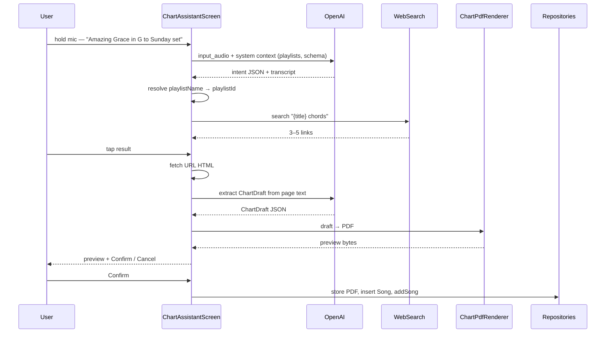

# AI chord chart integration — implementation plan

**Stage Manager (playlists)** · June 2026  
**Status:** Proposed (not implemented)  
**Audience:** Personal demo — not production. Copyright/licensing UX (disclaimers, lyric truncation) is **out of scope** for v0.1; extract full chords and lyrics from web sources for the author’s own use. Revisit if the app is shared or published broadly.

## Summary

Add a **voice-first AI assistant** to find songs on the internet (lyrics, chords, chord pages), turn them into a one-page PDF chart, and add them to a playlist after user confirmation.

**MVP (v0.1) in one sentence:** Hold mic → say the command → app searches the web → user taps a result → LLM extracts a chart → PDF preview → confirm → add to playlist.

The app uses the user’s **OpenAI API key** (stored locally, encrypted — never in git). v0.1 is OpenAI-only (voice input, web search, and extraction). Claude and multi-action commands come later.

This fits the existing model: charts are opaque PDF/image files with `title`, `keySignature`, and `notes` metadata. No Room schema change required for v0.1.

---

## MVP (v0.1) scope

### In scope

| # | Step | Detail |
|---|------|--------|
| 1 | **Voice command** | Push-to-hold mic on playlist detail (and/or main tabs). `RECORD_AUDIO` permission. |
| 2 | **Intent from audio** | Send WAV + text context to OpenAI → JSON `{ title, key?, playlistName?, action: "find_chart" }`. Show transcript (“Heard: …”). |
| 3 | **Resolve playlist** | Fuzzy-match spoken name against playlist list; default to current playlist when opened from detail. Confirm if ambiguous. |
| 4 | **Find on web** | Search “{title} chords” (+ key if given). Show 3–5 results (title, snippet, URL). **User taps one.** |
| 5 | **Extract** | Fetch page HTML/text → LLM extracts `ChartDraft` JSON. |
| 6 | **Render** | Single-column one-page PDF via `PdfDocument`. |
| 7 | **Confirm** | Preview (reuse `SongMediaViewer`) + “Add **Title (Key)** to **Playlist**?” |
| 8 | **Save** | `FileStorage` → `SongRepository.insert` → `playlistRepository.addSong` (append at end). |
| 9 | **Settings** | OpenAI API key only; encrypted storage. |

### Out of scope for v0.1

- Typed-only path (can be dev fallback; not required for ship)
- Refine by voice or text (“two columns”, “drop chorus”)
- Multi-action commands (delete, add existing, insert after another song)
- Claude / second provider
- Fully hands-free (no tap on search results or confirm)
- Auto-pick search result without user tap
- `addSongAfter` / positional insert
- Remote web UI parity
- Direct scraping of chord-site HTML parsers (UG etc.) — use fetch + LLM extract instead

### MVP flow

```text
Hold mic
  → audio + context (playlist names, current playlist, action schema)
  → OpenAI returns intent JSON
  → resolve playlist name → playlistId
  → web search → user picks URL
  → fetch page → LLM extract → ChartDraft
  → PDF preview
  → tap Confirm
  → archive + addSong(playlistId, songId)
```



### Expectations to set in UI

- **Voice** = command input, not full hands-free operation.
- User still **taps** a search result and **confirms** before anything is saved.
- Transcript always visible so misheard titles are caught before search.

---

## Problem

### Current behaviour

```text
Add song to playlist
  └─ PlaylistDetailScreen → AddSongDialog
       ├─ Search archive (title / key / notes)
       └─ Add placeholder page (🚧 title-only PNG)

Import from elsewhere
  └─ Share intent / URL download → ImportSongScreen → archive only
```

There is no way to **find or create** a real chart from a title. Placeholders (`PlaceholderImageGenerator`) render the title on a blank page. Users must find PDFs elsewhere, share them in, or upload via remote play.

### Pain points

| Area | Today |
|------|-------|
| Missing chart | Placeholder only — no chords |
| Finding charts | Manual browser + share import |
| Set-list prep | Quickstart matches archive or adds placeholders |
| Voice | None |

### What already works (reuse)

| Capability | Location |
|------------|----------|
| Persist PDF/PNG | `FileStorage.storeBytes` → `Music/StageManager/songs/` |
| Song row | `SongRepository.insert(title, keySignature, notes, filePath, fileType)` |
| Add to playlist (append) | `PlaylistRepository.addSong(playlistId, songId)` |
| Parse “Title Key” | `SongTitleMigration.parse("Amazing Grace G")` |
| Fuzzy title match | `QuickstartMatcher` |
| Preview PDF | `PdfHelper` + `SongMediaViewer` |
| URL fetch | `FileStorage.downloadUrl()` |
| Settings pattern | `SettingsScreen` + `AppPrefs` / `StageManagerState` |

**Gap for later:** `addSong` only appends (`maxPosition + 1`). Positional insert (“after OTHER SONG”) needs new `addSongAfter` / `addSongAt` in `Repositories.kt`.

---

## Voice and intent

### Audio is the user message, not a pre-parsed intent

You do **not** extract intent locally and send it with the audio. You send:

- **System (text):** role, playlist catalog `[{id, name}, …]`, current playlist id, allowed actions JSON schema, rules.
- **User (audio):** the recording.

OpenAI returns **intent as text/JSON**. The app validates and executes.

```json
{
  "action": "find_chart",
  "songTitle": "Amazing Grace",
  "key": "G",
  "playlistName": "Sunday set"
}
```

From playlist detail, `playlistName` may be omitted in speech; context supplies the current playlist.

### OpenAI options for v0.1

| Approach | Notes |
|----------|-------|
| **Audio model** (`gpt-audio-mini`, etc.) | `input_audio` block in Chat Completions; one call for speech → JSON |
| **Whisper + text model** | `/v1/audio/transcriptions` then cheap parse call; more moving parts |

Recommend **audio-capable model** for v0.1 simplicity (one provider, one key).

### Claude

Claude Messages API has **no native audio input**. Claude support = Whisper or on-device STT first, then text to Claude. Defer to v0.3+.

---

## Finding songs on the internet

“Find from the internet” is the **core** of v0.1 — not LLM-only generation from training data.

| Strategy | v0.1 | Later |
|----------|------|-------|
| **Web search + user picks URL** | ✅ MVP | Auto-pick when confidence high |
| **Fetch page + LLM extract** | ✅ MVP | — |
| **Direct PDF/image URL** | If search returns PDF link, download like share import | — |
| **LLM knowledge only** | ❌ Not MVP — hallucination risk | Emergency offline fallback |
| **Scrape chord sites (UG parsers)** | ❌ Fragile, ToS risk | Unlikely |
| **Licensed APIs (SongSelect, etc.)** | ❌ Cost/licensing | Maybe |
| **User paste URL** | Dev fallback / v0.1.1 | — |

**Content / copyright:** Personal demo only — no production compliance work in v0.1. Extract full lyrics and chords from fetched pages; no first-use disclaimer or lyric truncation required. Store `sourceUrl` in notes for convenience. If the app later ships to others, add disclaimers and content policy then.

---

## Chart representation and rendering

Structured JSON between extract and PDF (enables refinement in v0.2):

```json
{
  "title": "Amazing Grace",
  "key": "G",
  "capo": null,
  "columns": 1,
  "sections": [
    { "label": "Verse 1", "lines": ["G    C    G", "Em   D    G"] },
    { "label": "Chorus", "lines": ["G    C    G", "G    D    G"] }
  ],
  "notes": "4/4, moderate",
  "sourceUrl": "https://…"
}
```

Store `sourceUrl` in song `notes` or append for traceability.

**PDF** via `android.graphics.pdf.PdfDocument` (minSdk 26 OK). Single column v0.1; auto-shrink font to one page.

---

## Multi-action assistant (post-MVP)

v0.1 supports one action: **`find_chart`**. Later versions add a command language — model returns `{ "actions": [ … ] }`, app resolves names, confirms destructive steps, executes in order.

| Action type | Example | Confirm | Maps to |
|-------------|---------|---------|---------|
| `find_chart` | “Find chords for Amazing Grace in G for Sunday set” | Preview + confirm | v0.1 flow |
| `add_existing` | “Add Amazing Grace to Sunday set” | Light confirm | `playlistRepository.addSong` |
| `delete_song` | “Delete Old Chart” | Always — show playlists affected | `songRepository.delete` |
| `remove_from_playlist` | “Remove X from Sunday set” | Always | `playlistRepository.removeSong` |
| `generate_and_add` | “Find chart for X … after How Great Thou Art” | Preview + placement | find flow + **`addSongAfter`** (new) |

**Context per action:**

| Context | Used for |
|---------|----------|
| Playlist names + ids | All playlist-scoped actions |
| Current playlist | Default when omitted |
| Archive search hits | Resolve song title / disambiguate keys |
| Target playlist’s ordered song list | “after OTHER SONG” |

---

## Design decisions

### 1. Credentials — BYOK, not OAuth login

API keys from OpenAI Platform (and later Anthropic Console). Store in `EncryptedSharedPreferences`. Never in git, `BuildConfig`, or assets.

UI: “Connect your OpenAI account” + link to key creation page.

### 2. Provider roadmap

| Version | Provider |
|---------|----------|
| **v0.1** | OpenAI only (voice + search + extract) |
| **v0.3+** | Optional Claude for text extract (after STT) |
| **Interface** | `AiChartProvider` from day one for testability |

### 3. Playlist name resolution

`PlaylistDao` has no `findByName`. New **`PlaylistNameResolver`**: exact match → fuzzy (like `QuickstartMatcher`) → picker if ambiguous → error if none.

Confirm dialog shows resolved playlist on every save.

### 4. UI entry points

| Entry | Version |
|-------|---------|
| Playlist detail — mic / assistant | v0.1 |
| Settings — OpenAI key | v0.1 |
| Main tabs — floating mic | v0.1 if time; else v0.1.1 |
| Remote web | v1+ |

### 5. Networking

OkHttp for OpenAI, search API, and page fetch. `Dispatchers.IO` from ViewModel. No keys in logs. Works without remote play active.

---

## Architecture

```text
ui/screens/ChartAssistantScreen.kt   mic, search results, preview, confirm
ui/screens/SettingsScreen.kt         (+ OpenAI key section)
ui/ChartAssistantViewModel.kt        orchestration

ai/
  OpenAiClient.kt                    audio intent, extract, search
  ChartIntent.kt                     action types (find_chart first)
  ChartDraft.kt                      JSON (de)serialization
  ChartPrompts.kt                    system templates
  PlaylistNameResolver.kt
  SongNameResolver.kt                (v0.2+)

find/
  WebSearchService.kt                OpenAI search tool or SerpAPI
  PageFetcher.kt                     HTML → trimmed text

render/
  ChartPdfRenderer.kt                ChartDraft → PDF bytes

util/
  AiCredentialStore.kt               EncryptedSharedPreferences
  AudioRecorder.kt                   push-to-hold → WAV bytes
```

Persistence (unchanged):

```kotlin
val bytes = ChartPdfRenderer.render(draft)
val path = FileStorage.storeBytes(bytes, "pdf")
val songId = songRepository.insert(Song(title, key, notes, path, PDF))
playlistRepository.addSong(playlistId, songId)
```

---

## Phased rollout

### Phase 0 — Prerequisites (1–2 days)

- [ ] `AiCredentialStore` + Settings UI (OpenAI key)
- [ ] OkHttp + `OpenAiClient` skeleton (MockWebServer tests)
- [ ] `.gitignore` / docs: never commit keys

### Phase 1 — MVP v0.1: voice + find + add (1–1.5 weeks)

Build order (voice early, not last):

1. [ ] `ChartDraft` schema + extract prompt
2. [ ] `ChartPdfRenderer` — single column, one page
3. [ ] `WebSearchService` + `PageFetcher`
4. [ ] Extract pipeline: URL → ChartDraft → PDF (test with typed URL first)
5. [ ] `AudioRecorder` + mic UI + `RECORD_AUDIO`
6. [ ] OpenAI audio → intent JSON + transcript display
7. [ ] `PlaylistNameResolver`
8. [ ] Full flow: mic → search → pick → preview → confirm → save
9. [ ] Error states: no key, no network, no results, fetch failed, bad JSON
10. [ ] README + `update-readme` skill

### Phase 2 — v0.2 polish (3–5 days)

- [ ] Voice/text refine on preview (“shorter”, “two columns”)
- [ ] Archive dedup: “You already have Amazing Grace (G)”
- [ ] Auto-pick best search result when confidence high (still allow override)
- [ ] Typed command fallback (same pipeline, no mic)
- [ ] Voice confirm: “yes” / “cancel” on preview screen
- [ ] Paste URL fallback

### Phase 3 — v0.3 multi-action assistant (1 week)

- [ ] Action schema: `add_existing`, `delete_song`, `remove_from_playlist`, `generate_and_add`
- [ ] `addSongAfter` in `PlaylistRepository`
- [ ] Per-action confirm dialogs
- [ ] Send target playlist song list in context for “after OTHER SONG”

### Phase 4 — v1 (ongoing)

- [ ] Claude provider (STT + text)
- [ ] Replace placeholder workflow
- [ ] Remote HTTP endpoint (optional)
- [ ] Chart templates (hymn, Nashville numbers)
- [ ] Remote web parity (`edit.html`)

---

## Dependencies to add

| Dependency | Purpose |
|------------|---------|
| `com.squareup.okhttp3:okhttp:4.x` | OpenAI, search, page fetch |
| `androidx.security:security-crypto:1.1.0-alpha06` | Encrypted API key storage |
| `org.jetbrains.kotlinx:kotlinx-serialization-json` (optional) | ChartDraft / intent JSON |

No PDF library if using platform `PdfDocument`.

---

## Testing strategy

| Layer | Approach |
|-------|----------|
| `PlaylistNameResolver` | JVM unit tests |
| `ChartPdfRenderer` | Fixed draft → PDF magic bytes, page count = 1 |
| `OpenAiClient` | MockWebServer — audio request shape, extract response |
| `PageFetcher` | Fixture HTML files |
| `AiCredentialStore` | Round-trip encrypt |
| UI | Manual: mic → search → pick → preview → playlist row |

Do **not** call real APIs in CI.

---

## Risks and mitigations

| Risk | Mitigation |
|------|------------|
| Wrong chords / lyrics | Web source + preview; disclaimer; user picks URL |
| Misheard voice | Show transcript before search |
| Search noise / wrong page | User picks from list; show URL domain |
| Page fetch fails (JS paywall) | “Try another result” / paste URL (v0.2) |
| API cost | User’s key; short recordings; one extract per pick |
| One-page overflow | Auto scale font; warning if truncated |
| Wrong source / bad extract | User picks another search result; refine in v0.2 |

---

## Alternatives considered

| Alternative | Why not v0.1 |
|-------------|----------------|
| LLM-only (no web) | Not “find from internet”; hallucination |
| Backend proxy with your keys | Violates BYOK |
| Android `SpeechRecognizer` only | Still need OpenAI for search/extract; adds STT variance without simplifying |
| Scrape Ultimate Guitar | Fragile, legal risk |
| Typed-first MVP | User wants voice in first version |

---

## Open questions

1. **Search backend** — OpenAI built-in search vs separate SerpAPI key?
2. **Chart style** — ChordPro-like vs chord-only + section labels?
3. **Notes field** — Auto-fill `AI · {date} · {sourceUrl}`?
4. **Duplicate policy** — Block if same title+key exists, or allow second copy?
5. **Global mic** — Playlist detail only for v0.1, or main tabs too?

---

## Success criteria (v0.1)

- [ ] User configures OpenAI key in Settings; survives reboot; absent from git
- [ ] Push-to-hold mic on playlist detail; `RECORD_AUDIO` granted
- [ ] Spoken “find / add chart for {song} in {key} to {playlist}” → transcript shown
- [ ] Web search returns pickable results; tap fetches and extracts chart
- [ ] PDF preview matches normal song viewer behaviour
- [ ] Confirm adds song to **correct** playlist (spoken or current)
- [ ] No Room migration
- [ ] End-to-end on good network in ~30–60s

---

## Related docs

- `report/song-work-reorg.md` — future grouping of chart variants under one “work”
- `.cursor/skills/playlist-view-parity/SKILL.md` — if remote web gains assistant UI
- `scripts/multi_upload.py` — external PDF upload pattern via HTTP API
