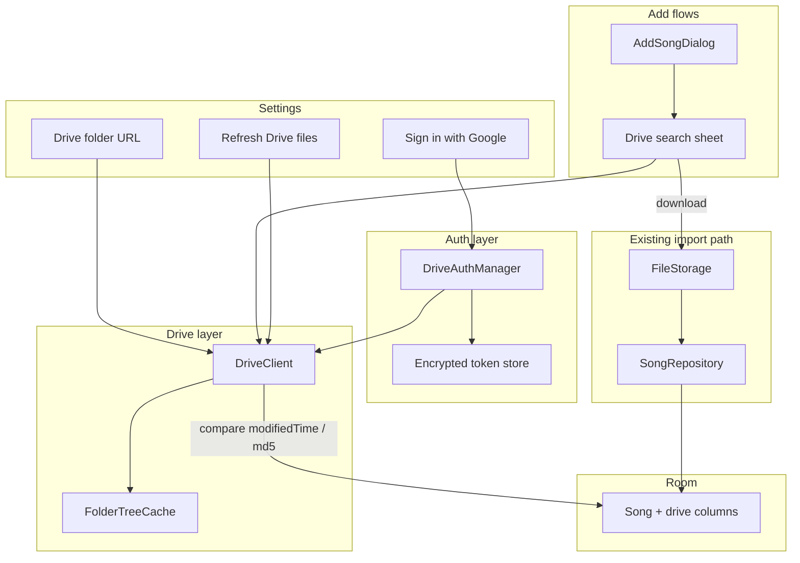

# Google Drive integration — implementation plan

**Stage Manager** · July 2026  
**Status:** Proposed (not implemented)  
**Audience:** Sideloaded APK; personal/small-group use first, then wider release via GitHub APK without Play Store.

## Summary

Add **Google Drive** as a source for chart files (PDFs and images). The user configures a **folder URL in Settings** as the **search root**, signs in with **their own Google account**, and can browse/search that folder tree when adding a song to a playlist or the archive. Selected files are **downloaded and imported** as local songs, with metadata marking them as **from Drive** (file ID, URL, import timestamp). A **Refresh Drive files** action in Settings re-downloads updated versions when the file changed on Drive.

**Primary use case:** a **team folder** (Google **Shared drive** — Workspace “shared drive” / consumer “shared drive”). The configured root URL will typically live on a Shared drive the band/team shares, not “My Drive” only. v1 **must implement Shared drive support** end-to-end (list, recursive search, download, refresh).

Authentication uses **official Google Android libraries** (Sign in with Google + Drive REST API v3). A **one-time Google Cloud project setup** by the app author registers the OAuth client; each end user signs in with their account at runtime. **Recursive search** under the configured root folder is required (not just top-level files).

---

## Goals

| Goal | Detail |
|------|--------|
| Configure search root | Settings field: Google Drive **folder URL** → parsed to folder ID (My Drive **or team Shared drive**) |
| **Team folders (Shared drives)** | **Required in v1.** Root URL may be a folder inside a Shared drive; all API calls must use Shared drive parameters (see § Team folders) |
| Sign in | User logs in with Google; app gets readonly Drive access for **that user** |
| Add from Drive | When adding to playlist or archive, show a **Drive icon** → search UI scoped to root folder (recursive) |
| Import | On accept: download file → same pipeline as share/upload import → new `Song` row |
| Provenance | DB fields: Drive file ID, web link, Drive `modifiedTime`, local `driveImportedAt`, optional Shared drive ID |
| Refresh | Settings button: for all Drive-linked songs, compare remote metadata; re-download if changed |

### Out of scope for v1

- Remote web UI parity (`edit.html` / `songs.html`) — Drive auth in browser-on-phone is awkward; **Android-only** initially
- Write-back to Drive (upload, rename, delete on Drive)
- Native Google Docs/Sheets/Slides as sources (export-to-PDF could be a later enhancement)
- Server-side token storage or multi-device sync of Google credentials
- App-side pre-check of OAuth test-user whitelist (see § OAuth FAQ)

---

## Developer setup vs end-user experience

These are **different roles**. Sideloading vs Play Store does **not** change OAuth behavior.

### One-time setup (app author — Google Cloud Console)

This is **not** a Gmail or Drive setting. It is **developer infrastructure** at [Google Cloud Console](https://console.cloud.google.com/):

1. Create or select a **Google Cloud project**
2. **Enable Google Drive API**
3. Configure **OAuth consent screen** (app name, support email, scopes)
4. Create an **Android OAuth client**:
   - Package name: `com.playlists.app`
   - SHA-1 of **debug** and **release** signing certificates (must match the APK users install)
5. Note the **OAuth client ID** (embedded in the app — not a secret)

No user Google password, service account key, or “master Drive token” goes in the app or repo.

### Runtime (each user on their device)

1. User taps **Sign in with Google** in Settings
2. Google account picker + consent: “View your Google Drive files” (`drive.readonly`)
3. App receives an **access token for that user’s account**
4. User pastes **folder URL**; app validates they can see that folder
5. Add-song / archive flows search and download **as that user**

User **Bob** never uses the developer’s Google account. Bob only sees folders Bob can access (owned, shared with Bob, or **Shared drive / team folder** membership).

**Team folder note:** each teammate signs in with their own Google account but points at the **same Shared drive folder URL**. Access depends on Workspace/shared-drive membership, not on sharing a single login.

---

## Team folders (Shared drives) — required for v1

Google **team folders** are **Shared drives** in the Drive API (formerly “Team Drives”). They behave differently from “My Drive” and need explicit API support — omitting this breaks the intended deployment.

### Why this matters

| My Drive | Shared drive (team folder) |
|----------|----------------------------|
| Files owned by the user | Files owned by the **team** |
| Default API behavior | Requires `supportsAllDrives=true` on **every** `files.get`, `files.list`, and download |
| Folder URL from personal drive | URL often under `…/drive/folders/{id}` on a Shared drive the team uses |

If the app only implements “My Drive” calls, a team folder URL will **fail validation**, return **empty search results**, or **404 on download** even when the user can open the folder in the Drive app.

### API requirements (implement on all Drive calls)

Every `files.list`, `files.get`, and media download must set:

- `supportsAllDrives = true`
- `includeItemsFromAllDrives = true` (on list/search)

When the root folder lives on a Shared drive, also capture and persist:

- **`driveId`** — Shared drive ID (from `files.get` on the root folder: `driveId` field)

Store `driveId` in AppPrefs alongside the root folder ID (and optionally on each imported song) so list/search/download/refresh stay scoped correctly.

### Validation flow for team folder URL

1. Parse folder ID from URL.
2. `files.get(fileId, supportsAllDrives=true)` with fields including `mimeType`, `driveId`, `name`.
3. Confirm `mimeType == application/vnd.google-apps.folder`.
4. If `driveId` is present → treat as **Shared drive** root; save `driveId` for subsequent calls.
5. Confirm signed-in user can list at least one child (smoke test with recursive walk start).

### User / admin expectations

- Teammates need **Google accounts** with access to the Shared drive (Workspace or consumer shared drive, per org policy).
- OAuth **Testing** mode: each teammate’s email must be a **test user** until the app is **In production**.
- Folder URL alone does not grant access — the signed-in user must already be a member of that Shared drive.

### Testing checklist (Shared drive)

- [ ] Root folder URL is inside a Shared drive (not My Drive)
- [ ] Recursive search finds files in nested subfolders on the Shared drive
- [ ] Import downloads PDF/image from Shared drive
- [ ] Refresh detects updated file on Shared drive and replaces local copy
- [ ] User without Shared drive membership gets a clear error (not empty silent failure)

---

## OAuth: Testing vs Production

Controlled in Cloud Console → **APIs & Services** → **OAuth consent screen** → **Publishing status**.

| Status | Who can sign in | Whitelist |
|--------|-----------------|-----------|
| **Testing** (default for new apps) | Only **Test users** listed on the consent screen | Yes — add Gmail/Workspace emails under **Test users** (~100 max) |
| **In production** | Any Google account (subject to consent + scope verification) | No per-user list in Console |

**Publish app** on the OAuth consent screen moves from Testing → Production.

- **Early sideload to a small group:** stay in Testing; add their emails as test users.
- **GitHub release for anyone:** move to **Production** so you do not maintain an email list.

The app **cannot** query Google for “is this email on the test-user list?” There is no client API for that. If a non-whitelisted user tries to sign in while the app is in Testing, OAuth **fails** (`access_denied` / 403); the app should catch that and show a clear message (e.g. ask the developer to add their email as a test user).

---

## What is stored where

| Location | What | Secret? |
|----------|------|---------|
| **APK / source** | OAuth **client ID** (`….apps.googleusercontent.com`) | No — public app identifier |
| **Device (encrypted prefs)** | Signed-in **account email**; tokens via Google auth libraries | Tokens yes — use EncryptedSharedPreferences (same pattern as `AiCredentialStore`) |
| **Device (AppPrefs / StageManagerState)** | Parsed **folder ID**, optional **Shared drive ID** (`driveId`) for team folder root | No |
| **Room DB (`songs`)** | `driveFileId`, `driveWebViewLink`, `driveModifiedTime`, `driveImportedAt`, optional `driveMd5Checksum`, optional `driveId` | No |
| **Local files** | Downloaded chart bytes under `Music/StageManager` (existing `FileStorage` layout) | N/A |

Do **not** commit tokens or Cloud Console service account keys to git.

---

## Folder URL as recursive search root

### Feasibility

**Yes.** A folder URL is a valid **scope boundary** for search:

1. Parse URL → folder ID (e.g. `https://drive.google.com/drive/folders/ABC123` → `ABC123`)
2. Validate with `files.get(folderId, supportsAllDrives=true)` — must be `application/vnd.google-apps.folder`; record `driveId` if on a Shared drive
3. List/search files whose **ancestor chain** includes that folder (Shared drive–aware lists)

The signed-in user must already have access to the folder (including **Shared drive membership** for team folders). The URL does not bypass permissions.

### URL formats to support

- `https://drive.google.com/drive/folders/{id}`
- `https://drive.google.com/open?id={id}`
- `https://drive.google.com/drive/u/0/folders/{id}`

Store **folder ID** internally; keep the original URL optionally for display.

### Recursive search (required)

Drive API query `'FOLDER_ID' in parents` returns **direct children only**. Nested charts in subfolders are **not** found with a single query.

**Required behavior:** treat the configured folder as **root** and search the **entire subtree**.

**Algorithm (recommended):**

```text
1. BFS/DFS from root folder ID (Shared drive aware):
   - files.list(
       q="'{id}' in parents and mimeType='application/vnd.google-apps.folder' and trashed=false",
       supportsAllDrives=true,
       includeItemsFromAllDrives=true,
       corpora='allDrives'   // when searching across Shared drives; or 'drive' + driveId if scoped
     )
   - accumulate all folder IDs in subtree (including root)
2. For search query Q and file-type filter:
   - For each folder ID (or batched OR query where API limits allow):
     files.list(same Shared drive flags, q="'{folderId}' in parents and trashed=false and …")
   - Merge, dedupe by file id, sort by name
3. Cache folder tree + file index on device; invalidate on manual refresh or TTL
```

**Team folders (Shared drives):** not optional — every list, get, and download in the above flow must pass `supportsAllDrives=true` and `includeItemsFromAllDrives=true`. Use `corpora='drive'` + stored `driveId` when the root is on a Shared drive, per [Drive API shared drive docs](https://developers.google.com/drive/api/guides/about-shareddrives).

**File types (v1):** PDF and images (`application/pdf`, `image/*`). Skip or show “unsupported” for native Google file types unless export is added later.

**Pagination:** handle `nextPageToken` on all list calls; large trees may need background indexing with progress UI.

---

## Architecture



### New components

| Component | Responsibility |
|-----------|----------------|
| `DriveAuthManager` | Sign in, sign out, `isSignedIn()`, account email, token lifecycle |
| `DriveCredentialStore` | Encrypted prefs for account id; delegate token refresh to `GoogleAccountCredential` |
| `DriveFolderUrl` | Parse and normalize folder URLs → folder ID |
| `DriveClient` | API wrapper: validate folder (**My Drive + Shared drive**), build folder tree, search, download, get metadata; always sets Shared drive flags |
| `FolderTreeCache` | Cached subtree folder IDs + optional file index; refresh on demand |
| `DriveImporter` | Download → `FileStorage` → `PendingImport` / title parse → `SongRepository.insert` with drive fields |
| `DriveRefreshJob` | Settings action: update changed Drive-linked songs |

### Reuse existing code

- **Import pipeline:** `ShareImporter`, `PendingImport`, `FileStorage`, `SongTitleMigration`, `SongRepository.insert`
- **Add UI hook:** extend `AddSongDialog` in `PlaylistDetailScreen.kt`
- **Settings pattern:** `SettingsScreen.kt`, `AppPrefs` / `StageManagerState`, `AiCredentialStore` for secrets
- **HTTP:** existing OkHttp can back the Google API client transport

---

## Database (Room migration 9 → 10)

Add nullable columns to `songs`:

| Column | Type | Purpose |
|--------|------|---------|
| `driveFileId` | `TEXT` | Stable Google file ID |
| `driveWebViewLink` | `TEXT` | Original file URL |
| `driveModifiedTime` | `INTEGER` | Last known Drive `modifiedTime` (epoch ms) |
| `driveImportedAt` | `INTEGER` | When this device last imported/synced |
| `driveMd5Checksum` | `TEXT` | Optional; for binary files when provided |
| `driveId` | `TEXT` | Optional; Shared drive ID when file came from a **team folder** |

Index: `CREATE INDEX index_songs_driveFileId ON songs(driveFileId)`.

AppPrefs / settings should also persist root **`driveId`** when the configured search root is on a Shared drive.

**Duplicate policy:** align with existing archive behavior — same Drive file may be imported multiple times with different key/notes (separate rows). Refresh updates each row by its own `driveFileId` + local `filePath`.

**UI:** optional Drive badge on archive rows when `driveFileId != null`.

---

## UI flows

### Settings

New section **Google Drive**:

- **Folder URL** — `OutlinedTextField`; save parsed folder ID on **Save**
- **Sign in with Google** / signed-in email + **Sign out**
- Validate folder on save (folder exists and user can read; **Shared drive / team folder** smoke test)
- **Refresh Drive files** — enabled when signed in; runs `DriveRefreshJob`, shows summary toast/dialog

### Add song (playlist)

Extend `AddSongDialog`:

```text
[ Search archive…                         ]
[ 🗂  Search Google Drive                  ]  ← Drive icon row
```

Tap Drive → bottom sheet:

- Requires sign-in + valid folder URL (else navigate/prompt Settings)
- Search field → recursive search under root
- Results: name, modified date, type
- Tap result → import confirm (title, key, notes — same as share import)
- On confirm: import + `addSong(playlistId, songId)` if opened from playlist

Archive-only add (if/when exposed) uses the same Drive search sheet without playlist attach.

---

## Refresh Drive files

For each song where `driveFileId IS NOT NULL`:

1. `files.get(id, supportsAllDrives=true, fields=modifiedTime,md5Checksum,mimeType,size)`
2. Compare to stored `driveModifiedTime` / `driveMd5Checksum`
3. If changed: download → replace local file at `filePath` (respect `SongFileOps` canonical naming) → update drive metadata and `driveImportedAt`
4. If file missing on Drive (`404`): flag song in UI; do not delete local file without user confirmation
5. Report: “N updated, M unchanged, K failed”

Run on `Dispatchers.IO`; show progress for large libraries.

Optional later: Wi‑Fi-only toggle.

---

## Dependencies (Gradle)

Approximate additions to `app/build.gradle.kts`:

```kotlin
implementation("com.google.android.gms:play-services-auth:21.2.0")
implementation("com.google.api-client:google-api-client-android:2.7.0")
implementation("com.google.apis:google-api-services-drive:v3-rev20240521-2.0.0")
// Optional: androidx.credentials for Credential Manager Sign in with Google
```

**OAuth scope:** `https://www.googleapis.com/auth/drive.readonly`

---

## Implementation phases

| Phase | Deliverable |
|-------|-------------|
| **0** | Google Cloud project, OAuth client (debug + release SHA-1), consent screen |
| **1** | `DriveAuthManager` + Settings sign-in / sign-out |
| **2** | Folder URL parse + validate; store folder ID |
| **3** | `DriveClient` + `FolderTreeCache` + **recursive search** + **Shared drive / team folder** support |
| **4** | Room migration + `DriveImporter` |
| **5** | Drive search in `AddSongDialog` |
| **6** | Refresh Drive files in Settings |
| **7** | Polish: badges, errors, offline, unit tests with mocked API |

**Rough effort:** medium feature — ~1–2 weeks for solid v1 with recursive search and refresh.

---

## Risks and decisions

| Topic | Recommendation |
|-------|----------------|
| Large folder trees | Cache subtree; index in background; paginate search results |
| API quotas | Batch list calls; debounce search input |
| **Team folders (Shared drives)** | **Required v1**, not optional — all API paths; test against a real Shared drive folder URL |
| Shared drive corpora / `driveId` | Persist root `driveId`; use correct `corpora` on list calls |
| OAuth verification | `drive.readonly` is usually straightforward for Production publish |
| Multiple Google accounts | v1: one signed-in account per device |
| Renamed files on Drive | Refresh by `driveFileId`; optional prompt to update title |
| Remote play parity | Defer; document as Android-only |

---

## OAuth & access FAQ

**Is the Cloud setup a feature of my Google account?**  
No. It is a **Google Cloud developer project**, not a Gmail/Drive setting.

**Do other users use my Google account?**  
No. Each user signs in with **their own** account.

**Do I whitelist users for sideloaded APKs?**  
Only while OAuth is in **Testing**. Add emails under **Test users**, or **Publish app** to Production for open sign-in.

**Can the app check whitelist membership before sign-in?**  
No API for that. Handle OAuth failure when a non-test user is blocked.

**Is folder URL as search root feasible?**  
Yes, with **recursive** folder traversal — not a single `in parents` query on the root alone. For **team folders (Shared drives)**, all calls must use Shared drive API flags (see § Team folders).

**Does this work with a team folder?**  
Yes, if v1 implements Shared drive support. Each teammate signs in with their own account and must be a member of that Shared drive.

**Do I store Google tokens in the app?**  
Client ID in the APK (fine). Per-user tokens on device, encrypted — not in git, not shared across users.

---

## Related repo docs

- `report/ai-chord-chart-integration.md` — similar import-to-archive pattern
- `.cursor/skills/playlist-view-parity/` — remote web parity (explicitly out of v1)
- `app/src/main/java/com/playlists/app/util/ShareImporter.kt` — file import pipeline to reuse
- `app/src/main/java/com/playlists/app/ui/screens/SettingsScreen.kt` — settings UI pattern
- `app/src/main/java/com/playlists/app/ui/screens/PlaylistDetailScreen.kt` — `AddSongDialog` extension point
