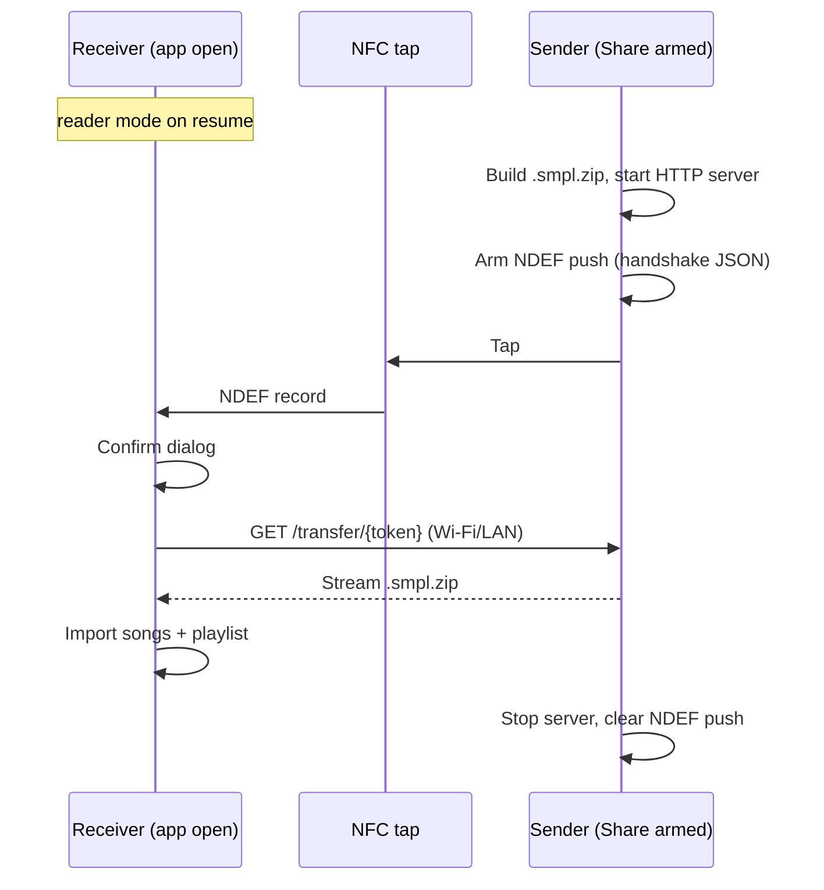

# NFC playlist sharing — implementation plan

**Stage Manager (playlists)** · June 2026  
**Status:** Proposed (not implemented)

## Summary

Add **nearby playlist transfer** between two phones running Stage Manager. The sender explicitly shares one playlist; the receiver listens whenever the app is in the foreground. A **tap** exchanges a small NFC handshake; **song files and metadata** transfer over **Wi‑Fi/LAN HTTP**. The receiver confirms, then imports songs and playlist order into `Music/StageManager/`.

NFC is the **tap-to-connect** step only — not the file transport. Android Beam was removed in Android 10; minSdk 26 means we use **NDEF push + reader mode**, not legacy beam file push.

---

## Target behaviour (chosen UX)

```text
Receiver phone
  → Stage Manager open (any screen)
  → NFC reader mode armed automatically

Sender phone
  → Open playlist → “Share via NFC”
  → App builds bundle + starts short-lived transfer server

Both phones
  → Hold backs together (tap)

Receiver
  → Reads handshake from NFC
  → Dialog: “Import <playlist name> (N songs, X MB) from nearby device?”
  → Accept → download bundle → import songs + playlist in order
  → Open new playlist (or toast + navigate)

Sender
  → Progress while receiver downloads
  → Disarm share mode on success or timeout
```

Only **one explicit action** on the sender (“Share via NFC”). No separate “Receive” button — receiving is implicit while the app is open.



---

## Problem

| Actor | Pain today |
|-------|------------|
| Musician with two phones / bandmate | No way to copy a full playlist (ordered songs + per-song metadata + sheet files) to another Stage Manager install |
| Export PDF | Combined PDF only — lossy for re-import (one file, no per-song archive rows) |
| System share sheet | One file at a time; no playlist structure |

---

## Constraints

| Constraint | Implication |
|------------|-------------|
| NFC payload size ~1–8 KB | Handshake only: host, port, token, playlist name, byte size |
| Playlist size often 5–50+ MB | Bulk transfer over HTTP on same Wi‑Fi |
| Android Beam removed (API 29+) | NDEF push on sender + `enableReaderMode` on receiver |
| NFC reader mode | Foreground activity only — matches “app open” UX |
| minSdk 26 | No Beam; reader mode + NDEF push are available |
| No NFC hardware on some devices | Hide/disable feature; `uses-feature` not required |

**Practical v1 requirement:** both phones on the **same Wi‑Fi** network. If not, tap may succeed but download fails — show a clear error.

---

## Bundle format (`.smpl.zip`)

New on-disk interchange format, separate from PDF export.

```text
manifest.json
songs/
  {uuid}.pdf
  {uuid}.jpg
```

**`manifest.json`** (schema version 1):

```json
{
  "version": 1,
  "playlist": {
    "name": "Sunday set",
    "colorArgb": 4280391411
  },
  "songs": [
    {
      "file": "songs/a1b2c3.pdf",
      "title": "Amazing Grace",
      "keySignature": "G",
      "notes": "capo 2",
      "fileType": "PDF"
    }
  ]
}
```

| Include | Exclude |
|---------|---------|
| Playlist name, accent color | Local DB ids |
| Song order (array order) | `lastViewedAt`, archive sort order |
| Title, key, notes per song | |
| Sheet files (PDF/image) | |
| `fileType` (IMAGE/PDF) | |

**Placeholder songs (🚧):** omit from bundle; manifest may list `skippedPlaceholders` count; receiver toast matches PDF export skip messaging.

**Missing files on sender:** skip entry; include `skippedMissing` in handshake or manifest; receiver reports count.

---

## Architecture

### Components (new)

| Component | Role |
|-----------|------|
| `PlaylistBundleExporter` | Playlist + songs → `.smpl.zip` in cache |
| `PlaylistBundleImporter` | Zip → new `Song` rows + `Playlist` + ordered `PlaylistSong` |
| `NfcTransferServer` | One-shot NanoHTTPD: `GET /transfer/{token}` streams zip; bind LAN only |
| `NfcTransferCoordinator` | Reader mode (receiver), NDEF push (sender), lifecycle tied to `MainActivity` |
| `NfcHandshake` | JSON in NDEF: `{ v, host, port, token, playlist, bytes, songs, skippedMissing }` |

MIME type for NDEF filter: `application/vnd.stagemanager.transfer+json`.

### Receiver: always listening while app is open

- `MainActivity.onResume` → `NfcAdapter.enableReaderMode()` with flags that skip NFC-A/B/F tag polling noise where possible; **only** handle records matching Stage Manager MIME.
- `MainActivity.onPause` → `disableReaderMode()`.
- Optional subtle UI: “Ready for nearby import” in app chrome (Settings toggle to hide indicator later).

### Sender: “Share via NFC”

- Entry point: playlist detail **pencil menu** (alongside Export PDF) and/or Playlists tab long-press menu.
- On tap:
  1. Build zip on `Dispatchers.IO` (progress if large).
  2. Start `NfcTransferServer` with random token, 2-minute TTL.
  3. `setNdefPushMessageCallback` with handshake pointing at `NetworkAddresses` LAN IPv4.
  4. Full-screen or bottom sheet: “Hold phones together” + cancel.
- On download complete or timeout: stop server, delete temp zip, clear NDEF callback.

### Import rules (receiver)

1. Validate `manifest.version`.
2. Create `Playlist`; suffix name if collision (`"Sunday set (2)"`).
3. For each song in manifest order:
   - Copy file into `StageManagerStorage.songsDir()` via `FileStorage` (new UUID filename).
   - `SongRepository.insert` → `PlaylistRepository.addSong` at position.
4. Transactional rollback on failure (delete partial files + DB rows).
5. Reuse patterns from `ShareImporter` / `FileStorage`, not `PlaylistPdfExporter`.

### Security

- Random single-use token; server accepts only `GET /transfer/{token}`.
- Bind to LAN interface (not `0.0.0.0` unless required for connectivity testing).
- Short server lifetime (~2 min).
- **Confirmation dialog** before import — prevents accidental imports from bumps.

### Manifest / permissions

```xml
<uses-permission android:name="android.permission.NFC" />
<uses-feature android:name="android.hardware.nfc" android:required="false" />
```

---

## UI

| Location | Control |
|----------|---------|
| Playlist detail (pencil menu) | **Share via NFC** (disabled if empty playlist or no NFC) |
| Playlists tab (optional) | Same on playlist row menu |
| App-wide (receiver) | No button — reader mode when foreground |
| Share flow | “Hold phones together” + progress + Cancel |
| Receive flow | System dialog: playlist name, song count, size → Accept / Decline |

**Errors (user-facing):**

- No NFC hardware
- NFC disabled in system settings → link to settings
- Not on same Wi‑Fi → “Connect both phones to the same Wi‑Fi and try again”
- Sender cancelled / timeout
- Import failed (corrupt bundle)

---

## Reuse from existing code

| Existing | Use for NFC |
|----------|-------------|
| `PlayRemoteServer` | Pattern for NanoHTTPD + token gate; **separate** server instance (different lifecycle) |
| `NetworkAddresses.kt` | LAN IP in handshake |
| `ShareImporter` / `FileStorage` | Store imported bytes |
| `SongRepository` / `PlaylistRepository` | Persist import |
| `StageManagerStorage` | Target `songs/` and DB |
| `PlaylistExportShare` | Not used — in-app flow, not system chooser |

---

## Edge cases

| Case | Handling |
|------|----------|
| Large playlist (100+ MB) | Size in handshake; confirm dialog shows MB; stream zip (don’t buffer entirely in RAM) |
| Receiver declines | Sender shows “Transfer declined”; stop server |
| Sender leaves share screen | Disarm NDEF + stop server |
| Duplicate playlist name | Auto-suffix on import |
| Same file, different metadata | Two archive rows (current app semantics) |
| Identical file bytes in bundle | One stored file; two rows if manifest has two entries (rare) |
| Non-Stage Manager NDEF | Ignored by MIME filter |
| Only one phone has NFC | Feature unavailable on that device |

---

## Out of scope (v1)

- Wi‑Fi Direct / Nearby Connections when phones are not on same AP
- Background receive when app is closed
- Tap-free room-scale discovery (mDNS/BLE)
- iOS (Android-only app)
- Merging into live `PlayRemoteServer` / remote play session

---

## Implementation phases

### Phase 1 — Bundle format (no NFC)

- `PlaylistBundleExporter` / `PlaylistBundleImporter`
- JVM unit tests: round-trip, order preserved, name collision, missing files, placeholders skipped
- Manual: export zip → import on same device (debug entry)

### Phase 2 — NFC UX (chosen option)

- `NfcTransferServer` + `NfcTransferCoordinator`
- Reader mode on `MainActivity` resume/pause
- “Share via NFC” in playlist UI
- Confirm dialog + import on receiver
- Error strings + NFC capability checks

### Phase 3 — Polish

- Transfer progress (bytes)
- Settings toggle: “Listen for nearby imports” (default on) for users who want to disable reader mode
- Sender success animation / navigate optional

### Phase 4 (optional) — Hard environments

- Nearby Connections or Wi‑Fi Direct when same-Wi‑Fi fails in the field

---

## Open decisions

1. **Playlist name collision:** auto-suffix only (proposed) vs prompt user?
2. **After import:** navigate to new playlist vs stay on current screen?
3. **Listen toggle default:** on (proposed) vs off until user opts in?
4. **Playlists tab:** share entry on list rows or detail-only for v1?

---

## Test plan

- [ ] Round-trip bundle export/import on one device (debug)
- [ ] Two physical devices, same Wi‑Fi: full tap → confirm → import
- [ ] Decline on receiver; sender handles gracefully
- [ ] Empty / placeholder-only playlist cannot share
- [ ] Missing song file on sender: skipped count shown on both sides
- [ ] No NFC device: menu item hidden or disabled with explanation
- [ ] App backgrounded on receiver: reader mode off; tap does nothing until app reopened
- [ ] `rebuild-app.sh` + JVM tests green after implementation
