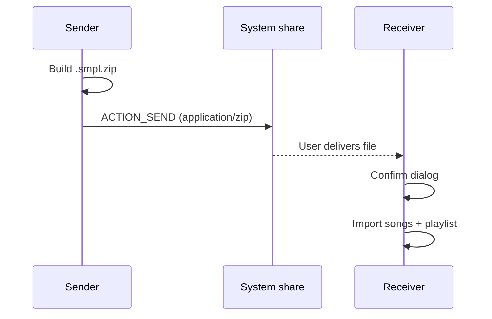
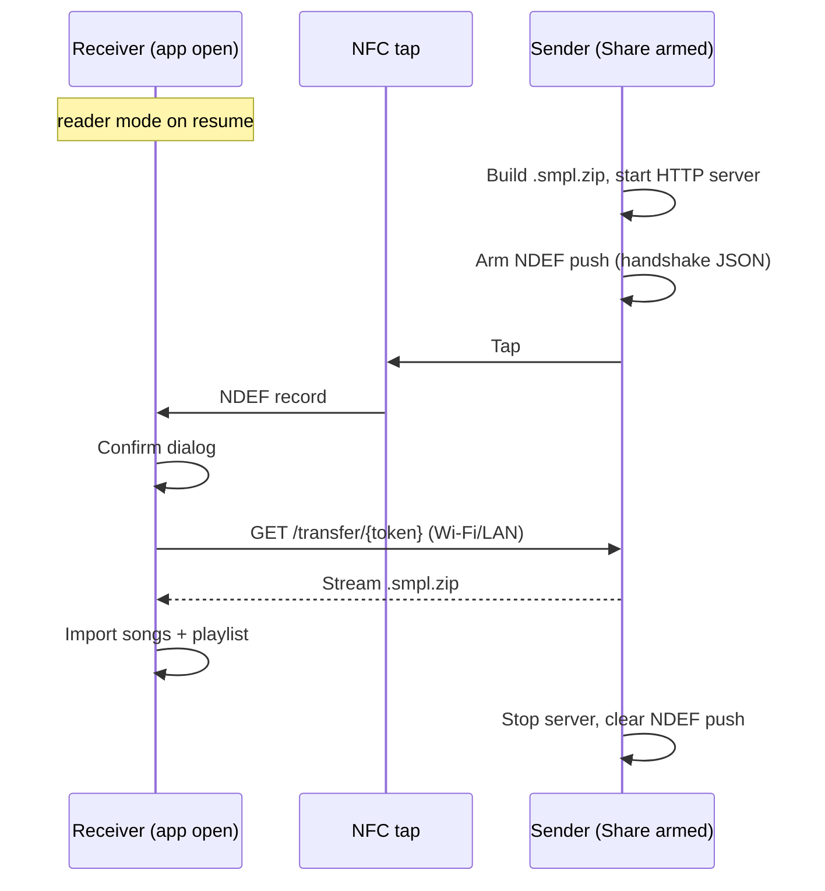

# Playlist bundle sharing — implementation plan

**Stage Manager** · June 2026  
**Status:** Proposed (not implemented)

## Summary

**v1:** Export a playlist as a **shareable `.smpl.zip`** (manifest + song files + metadata). The sender uses the system share sheet (Drive, email, Files, etc.); the receiver opens the zip with Stage Manager or shares it into the app. Import recreates the playlist, song order, per-song metadata, and sheet files (PDF/image) in `Music/StageManager/`.

**v2 (later):** Add **nearby NFC transfer** on top of the same bundle format. A **tap** exchanges a small NFC handshake; the zip streams over **Wi‑Fi/LAN HTTP**. NFC is the **tap-to-connect** step only — not the file transport. Android Beam was removed in Android 10; minSdk 26 means we use **NDEF push + reader mode**, not legacy beam file push.

---

## Target behaviour

### v1 — Shareable zip (chosen UX)

```text
Sender phone
  → Open playlist → “Export playlist bundle” (pencil menu)
  → App builds .smpl.zip in cache
  → System share sheet (Save to Drive, email, Nearby Share, Files, …)

Receiver phone
  → Open .smpl.zip with Stage Manager, or share zip into the app
  → Dialog: “Import <playlist name> (N songs, X MB)?”
  → Accept → import songs + playlist in order (including placeholders)
  → Open new playlist (or toast + navigate)
```

Same bundle format whether the zip travels by file share, cloud storage, or (in v2) NFC + LAN.


```mermaid
sequenceDiagram
    participant Tx as Sender
    participant Sheet as System share
    participant Rx as Receiver

    Tx->>Tx: Build .smpl.zip
    Tx->>Sheet: ACTION_SEND (application/zip)
    Sheet-->>Rx: User delivers file
    Rx->>Rx: Confirm dialog
    Rx->>Rx: Import songs + playlist
```

### v2 — NFC nearby transfer (same bundle)

```text
Receiver phone
  → Stage Manager open (any screen)
  → NFC reader mode armed automatically

Sender phone
  → Open playlist → “Share via NFC”
  → App builds bundle + starts short-lived transfer server

Both phones
  → Hold backs together (tap)

Receiver
  → Reads handshake from NFC
  → Dialog: “Import <playlist name> (N songs, X MB) from nearby device?”
  → Accept → download bundle → import songs + playlist in order
  → Open new playlist (or toast + navigate)

Sender
  → Progress while receiver downloads
  → Disarm share mode on success or timeout
```

Only **one explicit action** on the sender (“Share via NFC”). No separate “Receive” button — receiving is implicit while the app is open.


```mermaid
sequenceDiagram
    participant Rx as Receiver (app open)
    participant NFC as NFC tap
    participant Tx as Sender (Share armed)

    Note over Rx: reader mode on resume
    Tx->>Tx: Build .smpl.zip, start HTTP server
    Tx->>Tx: Arm NDEF push (handshake JSON)
    Tx->>NFC: Tap
    NFC->>Rx: NDEF record
    Rx->>Rx: Confirm dialog
    Rx->>Tx: GET /transfer/{token} (Wi‑Fi/LAN)
    Tx-->>Rx: Stream .smpl.zip
    Rx->>Rx: Import songs + playlist
    Tx->>Tx: Stop server, clear NDEF push
```

---

## Problem

| Actor | Pain today |
|-------|------------|
| Musician with two phones / bandmate | No way to copy a full playlist (ordered songs + per-song metadata + sheet files) to another Stage Manager install |
| Export PDF | Combined PDF only — lossy for re-import (one file, no per-song archive rows) |
| System share sheet | One file at a time; no playlist structure |

---

## Constraints

### v1 (shareable zip)

| Constraint | Implication |
|------------|-------------|
| Playlist size often 5–50+ MB | Stream zip I/O; show size in confirm dialog |
| Android share intents | Register `application/zip` (and/or custom MIME) for import via share / open-with |
| Large attachments | Some email clients cap size — user may use Drive / Files instead |

No same-Wi‑Fi requirement for v1; delivery is whatever channel the user picks in the share sheet.

### v2 (NFC + LAN)

| Constraint | Implication |
|------------|-------------|
| NFC payload size ~1–8 KB | Handshake only: host, port, token, playlist name, byte size |
| Playlist size often 5–50+ MB | Bulk transfer over HTTP on same Wi‑Fi |
| Android Beam removed (API 29+) | NDEF push on sender + `enableReaderMode` on receiver |
| NFC reader mode | Foreground activity only — matches “app open” UX |
| minSdk 26 | No Beam; reader mode + NDEF push are available |
| No NFC hardware on some devices | Hide/disable NFC menu item; zip share still works |

**Practical v2 requirement:** both phones on the **same Wi‑Fi** network. If not, tap may succeed but download fails — show a clear error.

---

## Bundle format (`.smpl.zip`)

New on-disk interchange format, separate from PDF export.

```text
manifest.json
songs/
  {uuid}.pdf
  {uuid}.jpg
  {uuid}.png          ← placeholder sheets (generated title PNGs)
  {uuid}.chart.json   ← optional, AI chart sidecar next to PDF
```

**`manifest.json`** (schema version 1):

```json
{
  "version": 1,
  "playlist": {
    "name": "Sunday set",
    "colorArgb": 4280391411
  },
  "songs": [
    {
      "file": "songs/a1b2c3.pdf",
      "title": "Amazing Grace",
      "keySignature": "G",
      "notes": "capo 2",
      "fileType": "PDF"
    },
    {
      "file": "songs/b2c3d4.png",
      "title": "Bridge 🚧",
      "keySignature": "Am",
      "notes": "placeholder",
      "fileType": "IMAGE"
    }
  ]
}
```

| Include | Exclude |
|---------|---------|
| Playlist name, accent color | Local DB ids |
| Song order (array order) | `lastViewedAt`, archive sort order |
| Title, key, notes per song | |
| Sheet files (PDF/image) | |
| **Placeholder songs (🚧)** — same as real songs: generated PNG + title/key/notes | |
| Optional `.chart.json` sidecar (`ChartDraftStore`) | |
| `fileType` (IMAGE/PDF) | |

**Maintain placeholders:** Placeholders are full archive rows (generated PNG on disk, DB metadata, playlist position). Export and import them like any other song — same rule as **Export PDF**, which already embeds placeholders. A Quickstart “Create with placeholders” set list must round-trip intact. Do not omit placeholders or block share for placeholder-only playlists.

**Missing files on sender:** skip entry only when the file is absent on disk; include `skippedMissing` in manifest (and NFC handshake in v2); receiver reports count.

---

## Architecture

### Components (new)

| Component | Phase | Role |
|-----------|-------|------|
| `PlaylistBundleExporter` | v1 | Playlist + songs (incl. placeholders) → `.smpl.zip` in cache |
| `PlaylistBundleImporter` | v1 | Zip → new `Song` rows + `Playlist` + ordered `PlaylistSong` |
| `PlaylistBundleShare` | v1 | Export via `Intent.ACTION_SEND` + `FileProvider` (mirror `PlaylistExportShare`) |
| `ShareImporter` extension | v1 | Parse zip share / open-with → pending bundle import + confirm dialog |
| `NfcTransferServer` | v2 | One-shot NanoHTTPD: `GET /transfer/{token}` streams zip; bind LAN only |
| `NfcTransferCoordinator` | v2 | Reader mode (receiver), NDEF push (sender), lifecycle tied to `MainActivity` |
| `NfcHandshake` | v2 | JSON in NDEF: `{ v, host, port, token, playlist, bytes, songs, skippedMissing }` |

v1 import MIME: `application/zip` and/or `application/vnd.stagemanager.playlist+zip`.  
v2 NDEF filter MIME: `application/vnd.stagemanager.transfer+json`.

### v1 — Export and file import

**Export (sender):**

- Entry point: playlist detail **pencil menu** and/or Playlists tab menu — **Export playlist bundle** (alongside Export PDF).
- On tap:
  1. Build zip on `Dispatchers.IO` (progress if large).
  2. Open system share sheet with `.smpl.zip` via `FileProvider`.

**Import (receiver):**

- `ACTION_SEND` / `ACTION_VIEW` with zip MIME → parse bundle → confirm dialog → `PlaylistBundleImporter`.
- Optional in-app **Import playlist bundle** file picker (same importer).

### v2 — Receiver: always listening while app is open

- `MainActivity.onResume` → `NfcAdapter.enableReaderMode()` with flags that skip NFC-A/B/F tag polling noise where possible; **only** handle records matching Stage Manager MIME.
- `MainActivity.onPause` → `disableReaderMode()`.
- Optional subtle UI: “Ready for nearby import” in app chrome (Settings toggle to hide indicator later).

### v2 — Sender: “Share via NFC”

- Entry point: same menus as v1 — **Share via NFC** (disabled if no NFC hardware).
- On tap:
  1. Build zip on `Dispatchers.IO` (progress if large).
  2. Start `NfcTransferServer` with random token, 2-minute TTL.
  3. `setNdefPushMessageCallback` with handshake pointing at `NetworkAddresses` LAN IPv4.
  4. Full-screen or bottom sheet: “Hold phones together” + cancel.
- On download complete or timeout: stop server, delete temp zip, clear NDEF callback.

### Import rules (all paths)

1. Validate `manifest.version`.
2. Create `Playlist`; suffix name if collision (`"Sunday set (2)"`).
3. For each song in manifest order (including placeholders):
   - Copy file into `StageManagerStorage.songsDir()` via `FileStorage` (new UUID filename).
   - Copy optional `.chart.json` sidecar when manifest references it.
   - `SongRepository.insert` → `PlaylistRepository.addSong` at position.
4. Transactional rollback on failure (delete partial files + DB rows).
5. Reuse patterns from `ShareImporter` / `FileStorage`, not `PlaylistPdfExporter`.

### Security

- **v1:** Confirm dialog before import; validate manifest version and zip structure.
- **v2:** Random single-use token; server accepts only `GET /transfer/{token}`.
- **v2:** Bind to LAN interface (not `0.0.0.0` unless required for connectivity testing).
- **v2:** Short server lifetime (~2 min).
- **v2:** Confirmation dialog before import — prevents accidental imports from bumps.

### Manifest / permissions

v1: extend `MainActivity` intent filters for zip import (no new permissions).

v2:

```xml
<uses-permission android:name="android.permission.NFC" />
<uses-feature android:name="android.hardware.nfc" android:required="false" />
```

---

## UI

### v1

| Location | Control |
|----------|---------|
| Playlist detail (pencil menu) | **Export playlist bundle** (disabled if playlist empty) |
| Playlists tab (optional) | Same on playlist row menu |
| Import | Open/share `.smpl.zip` into app, or optional file picker |
| Export flow | Build zip → system share sheet |
| Import flow | Confirm dialog: playlist name, song count, size → Accept / Decline |

**Errors (user-facing):**

- Empty playlist cannot export
- Import failed (corrupt bundle, unsupported manifest version)
- Missing song files on sender: `skippedMissing` count in toast after import

### v2

| Location | Control |
|----------|---------|
| Playlist detail (pencil menu) | **Share via NFC** (disabled if empty playlist or no NFC) |
| Playlists tab (optional) | Same on playlist row menu |
| App-wide (receiver) | No button — reader mode when foreground |
| Share flow | “Hold phones together” + progress + Cancel |
| Receive flow | System dialog: playlist name, song count, size → Accept / Decline |

**Errors (user-facing):**

- No NFC hardware
- NFC disabled in system settings → link to settings
- Not on same Wi‑Fi → “Connect both phones to the same Wi‑Fi and try again”
- Sender cancelled / timeout
- Import failed (corrupt bundle)

---

## Reuse from existing code

| Existing | Use for bundle sharing |
|----------|------------------------|
| `PlaylistExportShare` | v1 pattern for `FileProvider` + share sheet |
| `ShareImporter` / `FileStorage` | v1 zip import + store song bytes |
| `ChartDraftStore` | v1 optional sidecar copy on export/import |
| `SongRepository` / `PlaylistRepository` | Persist import |
| `StageManagerStorage` | Target `songs/` and DB |
| `PlaylistPdfExporter` | Skip logic for **missing files only** (not placeholders) |
| `PlayRemoteServer` | v2 pattern for NanoHTTPD + token gate; **separate** server instance |
| `NetworkAddresses.kt` | v2 LAN IP in handshake |

---

## Edge cases

| Case | Handling |
|------|----------|
| Large playlist (100+ MB) | Size in handshake; confirm dialog shows MB; stream zip (don’t buffer entirely in RAM) |
| Receiver declines | Sender shows “Transfer declined”; stop server |
| Sender leaves share screen | Disarm NDEF + stop server |
| Duplicate playlist name | Auto-suffix on import |
| Same file, different metadata | Two archive rows (current app semantics) |
| Identical file bytes in bundle | One stored file; two rows if manifest has two entries (rare) |
| Placeholder-only playlist | Fully shareable in v1 (set-list skeleton) |
| Placeholder round-trip | Title with 🚧, notes, and generated PNG preserved |
| Non-Stage Manager NDEF | Ignored by MIME filter (v2) |
| Only one phone has NFC | v2 NFC unavailable; v1 zip share still works |

---

## Out of scope

### v1

- NFC / LAN transfer (v2)
- Full archive export (playlist-scoped only)
- iOS (Android-only app)
- Merging into live `PlayRemoteServer` / remote play session

### v2+

- Wi‑Fi Direct / Nearby Connections when phones are not on same AP
- Background receive when app is closed
- Tap-free room-scale discovery (mDNS/BLE)

---

## Implementation phases

### Phase 1 — v1: Shareable zip (ship first)

- `PlaylistBundleExporter` / `PlaylistBundleImporter` / `PlaylistBundleShare`
- **Maintain placeholders** in export and import (round-trip with Quickstart set lists)
- Optional `.chart.json` sidecars for AI charts
- Extend `ShareImporter` + `MainActivity` intent filters for zip import
- UI: **Export playlist bundle** in pencil menu; confirm dialog on import
- JVM unit tests: round-trip, order preserved, name collision, missing files, **placeholders preserved**
- Manual: export zip → share → import on same or second device

### Phase 2 — v2: NFC nearby transfer

- `NfcTransferServer` + `NfcTransferCoordinator`
- Reader mode on `MainActivity` resume/pause
- “Share via NFC” in playlist UI (same `.smpl.zip` bundle)
- Confirm dialog + import on receiver
- Error strings + NFC capability checks

### Phase 3 — Polish

- Transfer progress (bytes) for large zips and NFC downloads
- Settings toggle: “Listen for nearby imports” (default on) for users who want to disable reader mode (v2)
- Sender success animation / navigate optional

### Phase 4 (optional) — Hard environments

- Nearby Connections or Wi‑Fi Direct when same-Wi‑Fi fails in the field

---

## Open decisions

1. **Playlist name collision:** auto-suffix only (proposed) vs prompt user?
2. **After import:** navigate to new playlist vs stay on current screen?
3. **Listen toggle default:** on (proposed) vs off until user opts in?
4. **Playlists tab:** share entry on list rows or detail-only for v1?

---

## Test plan

### v1 (shareable zip)

- [ ] Round-trip bundle export/import on one device (export → share → import)
- [ ] Second device or emulator: receive zip via Files / Drive / email
- [ ] Placeholder songs (🚧) preserved: title, key, notes, PNG, playlist position
- [ ] Placeholder-only playlist exports and imports successfully
- [ ] Quickstart “Create with placeholders” set list round-trips intact
- [ ] Missing song file on sender: entry skipped; `skippedMissing` reported
- [ ] Duplicate playlist name on import: auto-suffix
- [ ] Corrupt or wrong manifest version: clear error, no partial DB state
- [ ] `rebuild-app.sh` + JVM tests green after implementation

### v2 (NFC)

- [ ] Two physical devices, same Wi‑Fi: full tap → confirm → import
- [ ] Decline on receiver; sender handles gracefully
- [ ] No NFC device: NFC menu item hidden or disabled; zip export still available
- [ ] App backgrounded on receiver: reader mode off; tap does nothing until app reopened
