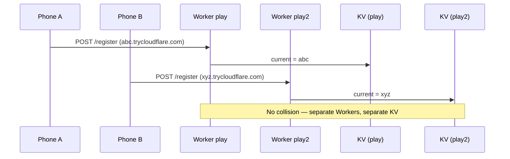

# Second stable play URL (`play2`) — implementation plan

**Stage Manager** · July 2026  
**Status:** Proposed (not implemented)

## Summary

Stage Manager’s **stable play URL** (`https://play.<account>.workers.dev`) gives one fixed bookmark that proxies to whichever Cloudflare quick tunnel the phone registered last. That works well for a **single** phone running remote play.

It does **not** support two people on **two phones** at the same time on the same stable address: both phones would POST to the same Worker KV key (`current`), and the second registration would overwrite the first.

This plan adds a **second stable slot** — typically a duplicate Worker named `play2` → `https://play2.<account>.workers.dev` — so each person bookmarks their own URL on the same Cloudflare account subdomain. Optional app changes let each phone auto-register to its chosen slot instead of hardcoding `play`.

See also: [`report/cloudflare-worker-stable-url.md`](cloudflare-worker-stable-url.md) (original stable-URL design).

---

## Problem

| Scenario | What happens today |
|----------|-------------------|
| Person A and Person B both use Stable mode, same Workers account | Both target `play.<sub>.workers.dev`; last phone to start remote play wins |
| Person A’s browser bookmark while B is active | Redirects to B’s tunnel — wrong phone, wrong playlists, PIN mismatch |
| `multi_upload.py` with shared `STAGE_MANAGER_URL` | Uploads go to whoever registered most recently |
| Two people want permanent bookmarks on the **same domain** | Not supported without a second slot |

Each phone already has its own **5-digit PIN** and its own **quick tunnel** (`*.trycloudflare.com`). The collision is only at the **Worker redirect layer** (one KV value per Worker).

---

## What is *not* the problem

| Concern | Reality |
|---------|---------|
| One phone, two simultaneous stable sessions | Impossible by design — `PlayRemoteController` is a singleton (one HTTP server, one `cloudflared` process) |
| Two people on the same Wi‑Fi | Already works via **LAN mode** with different ports/PINs per phone; no Worker needed |
| Ephemeral Cloudflare URLs | Already independent per session; only stable bookmarks collide |

---

## Current architecture

```text
Phone A                          Phone B
  cloudflared → abc.trycloudflare.com
  cloudflared → xyz.trycloudflare.com
         \                            /
          POST /register              POST /register
                   \                /
                    v              v
         Worker "play"  →  KV key "current"  →  one URL only
                    |
                    v
         https://play.<sub>.workers.dev  (shared bookmark)
```

Relevant code:

| Piece | Constraint |
|-------|------------|
| `workers/tunnel-redirect/src/index.ts` | Single KV key `current` |
| `TunnelRedirectClient.WORKER_NAME` | Hardcoded `"play"` |
| `AppPrefs.buildStableRedirectBase()` | Builds `https://play.<subdomain>.workers.dev` only |
| `SettingsScreen` | Stores account subdomain + write secret; no worker/slot name |
| `scripts/stage_manager_client.py` | `WORKER_NAME = "play"` |

Registration flow (unchanged from v1):



---

## Target behaviour

```text
One-time setup
  → deploy Worker "play"  (existing)
  → deploy Worker "play2" (copy, new KV namespace)
  → Phone A Settings: worker slot = play
  → Phone B Settings: worker slot = play2

Each session
  → each phone registers only its own Worker

Ongoing use
  → Person A bookmarks https://play.<sub>.workers.dev/?playlist=…
  → Person B bookmarks https://play2.<sub>.workers.dev/?playlist=…
  → independent tunnels, PINs, playlists
```

| Person | Stable URL | KV | Phone |
|--------|------------|-----|-------|
| A | `play.<sub>.workers.dev` | `play` namespace | Phone A |
| B | `play2.<sub>.workers.dev` | `play2` namespace | Phone B |

Same Cloudflare **account subdomain** (`<sub>`), different **worker names** on `*.workers.dev`.

---

## Recommended approach: duplicate Worker

Deploy a second instance of `workers/tunnel-redirect/` with a different Wrangler `name` and a **separate** KV namespace. No Worker code changes required — the script is already slot-agnostic; isolation comes from deploying twice.

### One-time ops (Person B / `play2`)

```bash
cd workers/tunnel-redirect
cp wrangler.toml wrangler.toml.play2   # or maintain a second checkout path

# Edit wrangler.toml.play2:
#   name = "play2"
#   id = "<NEW KV namespace id>"

npx wrangler kv namespace create TUNNEL --config wrangler.toml.play2
# paste id into wrangler.toml.play2

npx wrangler secret put WRITE_SECRET --config wrangler.toml.play2
# same secret as play is fine; separate secret also fine

npm run deploy -- --config wrangler.toml.play2
# → https://play2.<account>.workers.dev
```

Verify:

```bash
WORKER=https://play2.<sub>.workers.dev
SECRET=your-write-secret
TUNNEL=https://xyz.trycloudflare.com

curl -sS -X POST "$WORKER/validate" -H "Authorization: Bearer $SECRET"
curl -sS -X POST "$WORKER/register" \
  -H "Authorization: Bearer $SECRET" \
  -H "Content-Type: application/json" \
  -d "{\"url\":\"$TUNNEL\"}"
curl -sS "$WORKER/url"
```

### Before app changes (manual register)

Person B can use **Cloudflare tunnel (internet)** mode and register by hand after each session (same as pre-app stable URL workflow). Person A continues using **Stable play URL** in the app.

### After app changes (auto register)

Person B sets worker slot `play2` in Settings; **Stable play URL** mode registers `play2` automatically on start, same as `play` today.

---

## Android app changes

### Settings — worker slot name

Add a field under **Stable play URL**:

| Field | Type | Default | Notes |
|-------|------|---------|-------|
| Worker name | Text | `play` | Lowercase letters, numbers, hyphens; Wrangler `name` |

Preview URL becomes `https://<worker>.<subdomain>.workers.dev` (replace hardcoded `play` in supporting text).

Validation pattern: same as subdomain — `^[a-z0-9-]+$`, non-empty when stable redirect is configured.

### Persistence

Extend `StageManagerState` / `AppPrefs`:

```kotlin
getTunnelRedirectWorkerName(context): String  // default "play"
setTunnelRedirect(context, subdomain, workerName, secret)
buildStableRedirectBase(context): String?     // uses worker name + subdomain
```

Migration: existing installs with subdomain + secret configured → worker name defaults to `"play"` (no behaviour change).

### `TunnelRedirectClient`

Replace constant with parameter:

```kotlin
fun buildWorkerBaseUrl(workersSubdomain: String, workerName: String = DEFAULT_WORKER_NAME): String
```

Keep `DEFAULT_WORKER_NAME = "play"` for tests and backward compatibility.

### UI strings

Update `settings_stable_subdomain_supporting` from `https://play.<subdomain>.workers.dev` to a dynamic preview or generic `https://<worker>.<subdomain>.workers.dev`.

### No change required

| Component | Why |
|-----------|-----|
| `PlayRemoteController` | Already calls `AppPrefs.buildStableRedirectBase()` + `TunnelRedirectClient.publish()` |
| `PlayRemoteServer` | Per-phone HTTP server; unrelated to Worker slot |
| Worker TypeScript | Duplicate deploy, same source |

---

## Script changes

`scripts/stage_manager_client.py` today hardcodes `WORKER_NAME = "play"`.

Options (pick one):

| Option | Change |
|--------|--------|
| **A. Env override** | `STAGE_MANAGER_WORKER=play2` (default `play`) |
| **B. Full URL only** | Document `STAGE_MANAGER_URL=https://play2.<sub>.workers.dev` (already supported via `--url`) |
| **C. CLI flag** | `--worker play2` alongside `--domain` |

Recommend **A + B**: env `STAGE_MANAGER_WORKER` for `--domain` builds; `--url` / `STAGE_MANAGER_URL` for explicit base (works today).

Example:

```bash
# Person A
export STAGE_MANAGER_DOMAIN=you
export STAGE_MANAGER_WORKER=play
export STAGE_MANAGER_PIN=55555

# Person B
export STAGE_MANAGER_DOMAIN=you
export STAGE_MANAGER_WORKER=play2
export STAGE_MANAGER_PIN=49152
```

---

## Security model

| Concern | Mitigation |
|---------|------------|
| Shared write secret across `play` and `play2` | Acceptable for a household; either Worker accepts the same Bearer token |
| Separate secrets per slot | Deploy `WRITE_SECRET` independently per Worker; each phone stores its matching secret |
| Public read of tunnel URL | Unchanged — `GET /` and `/url` are public; PIN gates the phone tunnel |
| Cross-slot confusion | User-facing stable URL label should include slot name (“Stable URL (play2)”) |

Person A’s PIN does **not** protect Person B’s tunnel. Each phone keeps its own PIN in Settings (already per-device).

---

## Alternatives considered

| Approach | Two independent stable URLs? | Effort | Verdict |
|----------|-------------------------------|--------|---------|
| **Duplicate Worker (`play2`)** | Yes | Low ops; small app pref | **Recommended** |
| **Multi-slot single Worker** (KV keys `slot1`/`slot2`, `/register?slot=`) | Yes | Medium Worker + app + migration | Good if many slots; one deploy |
| **Custom domain paths** (`example.com/play`, `/play2`) | Yes | DNS + routes + Worker routing | Overkill for two users |
| **Named Cloudflare tunnel + DNS** | Yes | CF account, domain, tunnel creds | Best long-term; separate project |
| **Share one stable URL, take turns** | No | Zero | Current accidental behaviour |

---

## Files to add or modify

### Ops / docs (no code)

| Path | Change |
|------|--------|
| `workers/tunnel-redirect/README.md` | Section: deploying `play2` (second KV, second `name`) |
| This report | Design reference |

### Modify (app integration)

| Path | Change |
|------|--------|
| `TunnelRedirectClient.kt` | Parameterize worker name |
| `AppPrefs.kt`, `StageManagerState.kt` | Persist worker name |
| `SettingsScreen.kt` | Worker name field + live URL preview |
| `app/src/main/res/values/strings.xml` | Settings copy |
| `TunnelRedirectClientTest.kt`, `AppPrefsTunnelRedirectTest.kt` | Default + custom worker name |
| `scripts/stage_manager_client.py` | `STAGE_MANAGER_WORKER` env / `--worker` |
| `README.md` | Two-user stable URL setup (when implemented) |

### Do not modify (v1 of this feature)

| Path | Reason |
|------|--------|
| `workers/tunnel-redirect/src/index.ts` | Duplicate deploy is enough |
| `PlayRemoteController.kt` | Uses prefs indirection already |

---

## Implementation order

1. **Ops** — Deploy `play2` Worker + KV; verify with `curl` (no app release needed).
2. **Document manual path** — Person B registers tunnel by hand; use ephemeral URL or stable bookmark after register.
3. **App pref** — Worker name in Settings + `buildStableRedirectBase`.
4. **Tests** — JVM unit tests for URL building and defaults.
5. **Scripts** — `STAGE_MANAGER_WORKER` in `stage_manager_client.py`.
6. **README** — Two-person stable URL section.

---

## Tests

| Area | Approach |
|------|----------|
| `buildWorkerBaseUrl(subdomain, workerName)` | JVM unit test |
| Default worker name `"play"` for existing prefs | JVM migration test |
| Worker name validation | JVM unit test |
| `play2` deploy + register | Manual `curl` |
| Two phones simultaneous Stable | Manual — A on `play`, B on `play2`; both bookmarks resolve |

---

## Out of scope

- Three or more slots without additional Worker deploys (use multi-slot Worker variant instead).
- One phone serving two stable URLs at once.
- OAuth or in-app Cloudflare login.
- Custom domain on Workers (`play.example.com`) — compatible later via DNS routes to `play` / `play2` workers.dev names.
- Clearing KV on stop (same as v1 stable URL).

---

## References

- Original stable URL plan: [`report/cloudflare-worker-stable-url.md`](cloudflare-worker-stable-url.md)
- Worker source: `workers/tunnel-redirect/src/index.ts`
- Registration client: `app/src/main/java/com/playlists/app/remote/TunnelRedirectClient.kt`
- Remote play lifecycle: `app/src/main/java/com/playlists/app/remote/PlayRemoteController.kt`
- Settings UI: `app/src/main/java/com/playlists/app/ui/screens/SettingsScreen.kt`
- Upload scripts: `scripts/stage_manager_client.py`
