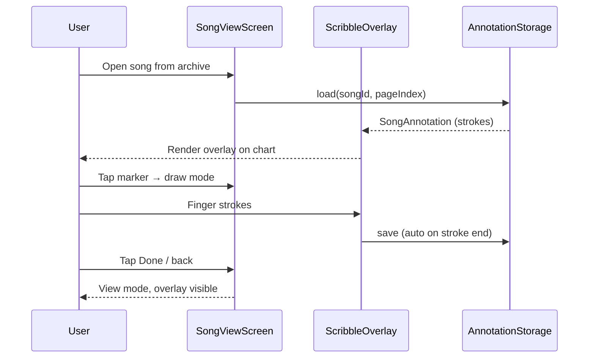

# Song scribble layer — implementation plan

**Stage Manager (playlists)** · June 2026  
**Status:** Proposed (not implemented)

## Summary

On the fullscreen **song viewer** (archive tap → image or PDF), add a **marker** icon that toggles draw mode. Strokes become a persistent **annotation layer** stored per song (and per PDF page) and shown every time that chart is opened — including during **playlist playback**.

Storage is vector strokes in JSON sidecar files under `Music/StageManager/annotations/`, keyed by `songId` + `pageIndex`. No Room migration for v1. Remote web playback (`play.html`) is out of scope for the first ship; document as an intentional parity gap.

---

## Problem

### Current behaviour

```text
SongViewScreen
  └─ SongMediaViewer
       ├─ IMAGE  → ZoomableImage (Coil, pinch zoom)
       └─ PDF    → PdfPagerViewer or SinglePdfPageViewer (swipe pages, pinch zoom)

PlaylistPlaybackScreen
  └─ PlaybackStage (tap/swipe nav, pinch zoom)
       └─ SongMediaViewer (enableZoom = false; zoom handled by stage)
```

Users can view charts fullscreen but cannot mark them up. Performance notes (fingerings, cues, last-minute key changes) live only in the text `notes` field on the song row — not on the sheet itself.

### Pain points

| Area | Today |
|------|-------|
| Song viewer | Read-only; no on-page markup |
| Playlist playback | Same — no overlay for chart-specific marks |
| Notes field | Text only; not spatial; not visible on the PDF/image |
| Persistence | No concept of a layer separate from the source file |

The source file (PDF/image) must stay immutable so imports, shares, and re-imports are unaffected.

---

## Target behaviour

```text
SongViewScreen (archive viewer)
  → tap marker icon → draw mode
  → scribble on current page (image = page 0; PDF = current page)
  → strokes auto-save to annotations/{songId}/page_{n}.json
  → exit draw mode → view mode with overlay visible
  → reopen song → overlay loads automatically

PlaylistPlaybackScreen
  → same overlay rendered read-only on top of media
  → no marker icon; playback gestures unchanged
```



---

## Design decisions

| Decision | Choice | Rationale |
|----------|--------|-----------|
| Scope | Archive viewer (edit) + playback (read-only) | Marks belong to the song, not a session |
| PDF pages | One annotation set per `(songId, pageIndex)` | Matches `PlaybackFrame` page expansion |
| Format | Vector strokes, normalized `0..1` coords | Zoom-independent; small files; undo/clear |
| Storage | JSON sidecar files, not Room | No DB migration; travels with StageManager folder |
| Draw location | `SongViewScreen` only | Playback nav gestures conflict with drawing |
| Stroke style (v1) | Fixed marker color + width | Minimize UI surface; extend later |
| Save semantics | Auto-save on stroke end | Forgiving; no lost work on back |
| Remote web | Phase 2 / intentional gap | API + canvas overlay is separate effort |

---

## Data model

### File layout

```text
Music/StageManager/
  songs/           ← existing chart files (unchanged)
  annotations/
    {songId}/
      page_0.json
      page_1.json
      …
```

Fallback when external storage is unavailable: mirror under `context.filesDir/annotations/` (same pattern as legacy internal songs dir).

### JSON schema (v1)

```json
{
  "version": 1,
  "songId": 42,
  "pageIndex": 0,
  "strokes": [
    {
      "points": [{ "x": 0.12, "y": 0.34 }, { "x": 0.15, "y": 0.38 }],
      "colorArgb": -65536,
      "widthDp": 4.0
    }
  ]
}
```

### Kotlin types (new)

```kotlin
data class SongAnnotation(
    val version: Int = 1,
    val songId: Long,
    val pageIndex: Int,
    val strokes: List<Stroke>,
)

data class Stroke(
    val points: List<NormalizedPoint>,
    val colorArgb: Int,
    val widthDp: Float,
)

data class NormalizedPoint(val x: Float, val y: Float)
```

Coordinates are relative to the **media content box** (the centered image/PDF bitmap), not the full black letterbox — so marks stay aligned across aspect ratios and screen sizes.

### Storage API (new `AnnotationStorage`)

| Method | Purpose |
|--------|---------|
| `load(songId, pageIndex)` | Read JSON or return null |
| `save(annotation)` | Write JSON; delete file if `strokes` empty |
| `deleteForSong(songId)` | Remove `annotations/{songId}/` tree |
| `hasAnnotations(songId)` | Optional; for future list badge |

---

## UI / UX

### SongViewScreen toolbar

```text
┌─────────────────────────────────────┐
│ ←  Amazing Grace (G)        🖊️     │  ← marker toggles draw mode
├─────────────────────────────────────┤
│                                     │
│         [ image / PDF page ]        │
│         + scribble overlay          │
│                                     │
├─────────────────────────────────────┤
│  (draw mode only)                   │
│  [ Undo ]  [ Clear page ]  [ Done ] │
└─────────────────────────────────────┘
```

| Mode | Gestures | Toolbar |
|------|----------|---------|
| **View** (default) | Pinch zoom + pan; PDF page swipe | Marker icon only |
| **Draw** | Single-finger draw; zoom disabled | Undo, Clear page, Done |

- Marker icon highlighted while in draw mode.
- **Undo** removes last stroke (in memory + persist).
- **Clear page** removes all strokes for current page (confirm optional).
- **Done** exits draw mode (strokes already saved).
- Multi-page PDF in draw mode: disable horizontal pager swipe; show page indicator; optional prev/next chips in draw toolbar.

### PlaylistPlaybackScreen

- Render `ScribbleOverlay` with `isEditable = false` above `SongMediaViewer`.
- Pass `songId` and `pageIndex` from existing `PlaybackFrame`.
- No toolbar changes.

---

## Component architecture

```text
SongViewScreen
  └─ AnnotatedMediaViewer          (new)
       ├─ SongMediaViewer          (existing — base layer; zoom state lifted)
       └─ ScribbleOverlay          (new — annotation layer)

PlaylistPlaybackScreen
  └─ PlaybackStage
       └─ AnnotatedMediaViewer (isEditable = false)
```

### ScribbleOverlay

1. Load annotation for `(songId, pageIndex)` on key change.
2. Render strokes with Compose `Canvas` + `drawPath`.
3. Map normalized coords → layout size inside media bounds.
4. Share `graphicsLayer` scale/offset with the media layer (zoom alignment).
5. In draw mode: `pointerInput` captures touch path → append `Stroke` → save.

### SongMediaViewer refactor

Zoom/pan state currently lives inside `ZoomableImage` and `PdfPageImage`. **Lift** scale + offset to `AnnotatedMediaViewer` and pass transforms to both media and overlay. Drawing on top of zoomed content in view mode requires this; drawing in draw mode uses `scale == 1`.

---

## Gesture matrix

| Surface | View mode | Draw mode |
|---------|-----------|-----------|
| SongViewScreen (image) | Pinch zoom + pan | Single-finger draw |
| SongViewScreen (PDF pager) | Swipe pages + zoom | Draw only; explicit page change |
| PlaylistPlaybackScreen | PlaybackStage nav + zoom | Overlay visible; no editing |

---

## Lifecycle & cleanup

| Event | Action |
|-------|--------|
| Stroke completed | Auto-save to sidecar JSON |
| Song hard-deleted (file removed) | `AnnotationStorage.deleteForSong(songId)` |
| Song soft-deleted (still in playlists) | Keep annotations |
| Placeholder song | Annotations allowed (same `songId` key) |
| Storage migration (path remap) | Unaffected — keyed by `songId`, not file path |
| Empty strokes after clear | Delete JSON file |

Hook `deleteForSong` in `SongRepository.delete(id, deleteFile = true)` (or equivalent).

---

## Remote parity

Per [playlist-view-parity](../.cursor/skills/playlist-view-parity/PARITY.md), playback features normally sync to `play.html`. Scribbles are **local-only in v1**:

| Behaviour | Local | Remote | Status |
|-----------|-------|--------|--------|
| View scribble overlay | Yes | — | **Intentional gap (v1)** |
| Edit scribbles | SongViewScreen | — | **Intentional gap (v1)** |

Phase 2 remote options:

- `GET /api/songs/{id}/annotations?page=n` → JSON; canvas/SVG overlay in `play.html`
- Or rasterized PNG per page (heavier; easier to render)

---

## Implementation phases

### Phase 1 — MVP

1. `SongAnnotation` model + `AnnotationStorage`
2. `ScribbleOverlay` (render + capture)
3. Lift zoom state in `SongMediaViewer`; add `AnnotatedMediaViewer`
4. `SongViewScreen`: marker toggle + draw toolbar
5. `PlaylistPlaybackScreen`: read-only overlay
6. Delete annotations on song file delete
7. Unit tests: JSON round-trip, coord mapping
8. `rebuild-app` + README song-viewer bullet

### Phase 2 — polish

- Eraser, color picker, stroke width
- “Clear all pages” for multi-page PDFs
- Optional song-list indicator (dot when annotations exist)
- Dirty-state / discard prompt on back from draw mode (if not auto-saving)

### Phase 3 — remote (optional)

- Worker/API endpoint for annotation JSON
- `play.html` overlay layer
- Update PARITY.md

---

## File map

```text
app/src/main/java/com/playlists/app/
  data/SongAnnotation.kt              # model
  util/AnnotationStorage.kt           # JSON I/O
  ui/components/ScribbleOverlay.kt    # Canvas layer
  ui/components/AnnotatedMediaViewer.kt
  ui/components/SongMediaViewer.kt    # zoom state lift
  ui/screens/SongViewScreen.kt      # marker + toolbar
  ui/screens/PlaylistPlaybackScreen.kt
  data/SongRepository.kt              # delete hook

app/src/main/res/values/strings.xml   # marker, undo, clear, done

app/src/test/java/.../
  util/AnnotationStorageTest.kt
  ui/ScribbleCoordMappingTest.kt      # if extracted

report/song-scribble-layer.md       # this document
```

---

## Edge cases

| Case | Handling |
|------|----------|
| PDF with 0 rendered pages | No overlay until page loads |
| Very long scribble session | Cap stroke count or file size (unlikely needed v1) |
| Concurrent edit | Single device; last write wins |
| Import replaces file for same song | Annotations stay (keyed by id, not path) — usually desired |
| Rotation | Normalized coords relative to content box, not screen |

---

## Open questions

1. **Playback editing?** Plan assumes read-only in playback. Draw mode there would need a “lock nav” toggle.
2. **Auto-save vs explicit Done?** Recommended: auto-save on stroke end; Done only exits mode.
3. **Remote in v1?** Recommended: defer; keeps scope contained.
4. **Multiple layers?** v1 is one marker layer per page. Separate layers (e.g. chords vs lyrics) would need layer UI.

---

## Effort estimate

| Phase | Size |
|-------|------|
| Phase 1 MVP | ~400–600 LOC, 1–2 focused sessions |
| Phase 2 polish | +1 session |
| Phase 3 remote | +1–2 sessions |

Highest risk: **shared zoom transforms** between `SongMediaViewer` and `ScribbleOverlay`. Remaining work is standard Compose `Canvas` + JSON I/O.

---

## Related docs

- [README.md](../README.md) — song viewer, playback behaviour
- [playlist-view-parity/PARITY.md](../.cursor/skills/playlist-view-parity/PARITY.md) — local ↔ remote matrix
- [cloudflare-worker-stable-url.md](./cloudflare-worker-stable-url.md) — unrelated; same report series
