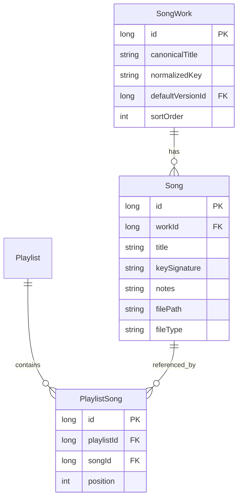

# SongWork reorg — implementation plan

**Stage Manager (playlists)** · June 2026  
**Status:** Proposed (not implemented)

## Summary

The song archive today is a **flat list of chart files**: each PDF/image is one `songs` row with its own `title`, `keySignature`, and `notes`. Multiple charts for the same piece (different keys, bass vs lyrics, etc.) appear as separate, duplicate-looking entries.

This plan introduces **SongWork** as the logical song (one title, one cluster) and keeps existing `songs` rows as **versions** (concrete charts). Playlists continue to reference a specific version via `playlist_songs.songId` — setlists need a real key at performance time.

---

## Problem

### Current model

```text
songs (flat)
  id, title, keySignature, notes, filePath, fileType, …

playlist_songs
  playlistId, songId, position   ← points at one chart row
```

Each imported file becomes an independent archive row. Title is the only implicit grouping signal, and it is unreliable (`Tu Vuo' Fa' L'Americano` vs `Tu Vuo' Fa L'Americano`).

### Observed duplicates (live archive, June 2026)

Five title groups, **11 entries** among **66 songs**:

| Work (normalized) | Version IDs | Key & notes |
|-------------------|-------------|-------------|
| Tu Vuo' Fa L'Americano | 16, 22, 45 | D- · E- · lyrics |
| Banana Republic | 17, 18 | G · D |
| Il Mondo | 12, 50 | D / E — electric bass · lyrics |
| Jeeg | 29, 49 | C- — Bass (no intro) · lyrics |
| Volare | 26, 56 | G — Salimblues · lyrics |

Near-matches that must **not** auto-merge: `Scende Caroline` / `Sweet Caroline`, `Hey Man` / `Ue Man`.

### Pain points

| Area | Today |
|------|-------|
| Songs archive | Same title repeated; hard to see “one song” |
| Search / add to playlist | Multiple flat hits for one piece |
| Quickstart paste | Picks one arbitrary version; ignores key hints weakly |
| Import | New key of known song creates another orphan row |
| Remote `edit.html` | Same flat search as local |

---

## Target behaviour

```text
SongWork  = the piece        ("Jeeg")
Song      = one chart/file   (C- bass, lyrics-only, …)
Playlist  = ordered list of Song versions (concrete keys for the gig)

Archive UI     → one row per SongWork, expandable versions
Search / add   → match work first, then pick version (or use default)
Quickstart     → line → work, optional key token → version
Import         → attach to existing work when normalized title matches
Playback       → unchanged (already uses a specific songId)
```



---

## Architecture

### SongWork (new entity)

| Field | Purpose |
|-------|---------|
| `id` | Primary key |
| `canonicalTitle` | Display name for the cluster |
| `normalizedKey` | Indexed grouping key (see normalization) |
| `defaultVersionId` | Preferred chart when key is unspecified |
| `sortOrder` | Archive ordering at work level |

### Song (existing entity, extended)

Keep all current columns. Add:

| Field | Purpose |
|-------|---------|
| `workId` | FK → `song_works.id` |

`title` on `Song` may stay in sync with `canonicalTitle` for versions, or hold version-specific overrides — **recommend keeping per-version title equal to canonical title** after migration; key/notes distinguish versions.

### What stays the same

- `playlist_songs.songId` → still a **version** id
- Playback, media serving, file storage paths
- Soft delete (`deletedAt`) per version
- Placeholders (`isPlaceholder`) per version

---

## Title normalization

Single shared function for migration, search, import, and quickstart. Base rules (aligned with `QuickstartMatcher`):

```kotlin
fun normalizeWorkTitle(title: String): String =
    title.lowercase()
        .replace(Regex("[''`´]"), "")
        .replace(Regex("[^a-z0-9\\s]"), " ")
        .replace(Regex("\\s+"), " ")
        .trim()
```

| Rule | Rationale |
|------|-----------|
| Strip apostrophes | `Tu Vuo' Fa' L'Americano` ≡ `Tu Vuo Fa Lamericano` |
| Alphanumeric + spaces only | Punctuation variants collapse |
| **No fuzzy auto-merge** | Caroline / Hey Man pairs stay separate unless user merges |

Store result in `SongWork.normalizedKey`. Do not rely on runtime fuzzy matching for persistence.

---

## Database migration (v7 → v8)

### Schema

```sql
CREATE TABLE song_works (
    id INTEGER PRIMARY KEY AUTOINCREMENT NOT NULL,
    canonicalTitle TEXT NOT NULL,
    normalizedKey TEXT NOT NULL,
    defaultVersionId INTEGER,
    sortOrder INTEGER NOT NULL DEFAULT 0
);
CREATE INDEX index_song_works_normalizedKey ON song_works(normalizedKey);

ALTER TABLE songs ADD COLUMN workId INTEGER REFERENCES song_works(id);
CREATE INDEX index_songs_workId ON songs(workId);
```

### Backfill algorithm

1. Select all non-deleted `songs`.
2. Group by `normalizeWorkTitle(title)`.
3. For each group:
   - Insert `SongWork` with `canonicalTitle` = most common title spelling in group (or lowest `id` row’s title).
   - Set each member’s `workId`.
   - Set `defaultVersionId`:
     1. Version with non-empty `keySignature` and non-“lyrics” notes
     2. Else most recently viewed (`lastViewedAt`)
     3. Else lowest `id`
4. Assign `sortOrder` on works (preserve current archive order — first version’s `sortOrder`).
5. Enforce `workId NOT NULL` after backfill (new migration step or v8 constraint).

### Edge cases

| Case | Handling |
|------|----------|
| Singleton (no duplicates) | Still gets a `SongWork` (1:1) — uniform model |
| Deleted versions | Included in group if not deleted; orphaned works cleaned if all versions deleted |
| Title edit after migration | Prompt: update work title or version-only label |
| Manual merge | Move `workId` on selected versions; delete empty work |
| Manual split | New work for split-off version |

---

## UX changes

### Songs archive (`SongsScreen.kt`)

**Before:** flat list — `Title (Key)` per row.  
**After:** grouped list — one row per work, expand to show versions.

```text
▾ Jeeg
    C- — Bass (no intro)          PDF
    lyrics                        PDF
▸ Volare
▸ Tu Vuo' Fa L'Americano
```

Actions:

- Tap version → open viewer (unchanged)
- Long-press / edit menu → **Merge into…**, **Split from work**, **Set as default version**
- Work-level sort buttons apply to works; version order within work: key, then notes

### Add to playlist (`PlaylistDetailScreen.kt`, `edit.html`)

Search returns **works**, not every version:

```text
Jeeg — 2 versions (C-, lyrics)
```

On select:

| Input | Behaviour |
|-------|-----------|
| Query contains key hint (`jeeg c-`) | Auto-pick matching version |
| Multiple versions, no hint | Version picker sheet |
| Single version | Add directly |
| No hint, has default | Add `defaultVersionId` (configurable in settings) |

Playlist rows still show `Title (Key)` via `SongDisplay.titleWithKey`.

### Quickstart (`QuickstartMatcher.kt`)

Two-step match:

1. **Line → work** — fuzzy score on `canonicalTitle` (existing token overlap logic).
2. **Key in line → version** — match `keySignature` / notes within that work’s versions.

Examples:

| Line | Result |
|------|--------|
| `Jeeg` | Jeeg / default or lyrics |
| `Jeeg C-` | Jeeg / C- — Bass (no intro) |
| `Volare G` | Volare / G — Salimblues |

### Import (`ShareImporter.kt`, upload flow)

On save:

1. Compute `normalizedKey` from parsed title.
2. If work exists → create new **version** under it (offer “Create as separate song” override).
3. If new work → create work + first version.

---

## Remote API (parity)

Keep flat endpoints for backward compatibility; add grouped endpoints.

| Method | Path | Response |
|--------|------|----------|
| `GET` | `/api/works` | `{"works":[{"id","canonicalTitle","versionCount","versions":[…]}]}` |
| `GET` | `/api/works/search?q=` | Grouped search for editor |
| `GET` | `/api/songs` | Existing flat list + `"workId"` field |
| `POST` | `/api/works/merge` | `{"versionIds":[…],"canonicalTitle"?}` |
| `POST` | `/api/works/{id}/split` | `{"versionId":…}` |
| `POST` | `/api/works/{id}/default` | `{"versionId":…}` |

Update `app/src/main/assets/remote/edit.html` search/add flow to match local grouped UX. See `.cursor/skills/playlist-view-parity/SKILL.md`.

---

## Implementation phases

| Phase | Deliverable | User value |
|-------|-------------|------------|
| **1** | `SongWork` entity, migration v8, `workId` on `Song`, repository layer | Correct data model; no UI change |
| **2** | Grouped Songs screen, version expand/collapse | Archive no longer shows duplicate titles |
| **3** | Grouped search + version picker (local + remote) | Clean add-to-playlist |
| **4** | Quickstart work → version matching | Smarter setlist paste |
| **5** | Merge / split / set-default UI; import auto-attach | Long-term archive hygiene |
| **6** | Remote API + `edit.html` parity, README | Web matches app |

Phases 1–2 address ~80% of duplicate clutter with a bounded schema change.

---

## Open decisions

| Question | Recommendation |
|----------|----------------|
| Default version when key unspecified? | User-set per work (`defaultVersionId`); fallback: first keyed version |
| Add without picker when ambiguous? | Show picker (don’t silently guess) |
| Rename version title? | Prompt: “Update work title for all versions?” |
| Version sort within work? | Key (alpha), then notes |
| Keep `Song.title` column? | Yes — denormalized copy of `canonicalTitle` for simpler queries; sync on work rename |

---

## Testing

| Area | Approach |
|------|----------|
| `normalizeWorkTitle` | JVM unit tests (apostrophe, punctuation, unicode) |
| Migration v7→v8 | In-memory Room test with fixture DB containing known duplicates |
| Quickstart work→version | Unit tests on Jeeg / Volare / Tu Vuo' cases |
| Grouped search | Repository test: one result per work |
| Remote API | Manual curl against remote play session |
| Playlist playback | Regression: existing `songId` references unchanged |

---

## Implementation order

1. `SongWork` entity + DAO + `SongWorkRepository`
2. Migration v8 + backfill + unit tests
3. Wire `workId` on insert/import paths
4. Grouped `SongsScreen`
5. Grouped search + version picker (Compose)
6. `QuickstartMatcher` two-step match
7. Merge / split / default UI
8. `PlayRemoteServer` + `edit.html` parity
9. README update

---

## Out of scope (v1)

- Automatic fuzzy merge suggestions (UI “possible duplicates” banner — later)
- Work-level artwork / metadata beyond title
- Playlist entries pointing at `workId` instead of `songId` (always concrete version)
- Cross-work aliases (“Volare” / “Nel blu dipinto di blu” as one work)
- Sync / export format changes (may add `workId` to backup JSON in a follow-up)

---

## Alternatives considered

| Approach | Pros | Cons | Verdict |
|----------|------|------|---------|
| **SongWork + Song versions** | Explicit, merge/split, stable IDs | One migration, UI work | **Chosen** |
| UI-only group by normalized title | No schema change | Fragile; no manual override; duplicates in DB | Reject |
| `parentSongId` self-FK on `songs` | Smaller schema | Awkward canonical title, default version, sorting | Reject |
| Unique constraint on `title` | Simple | Cannot store multiple keys | Reject |
| Key in title string `"Jeeg (C-)"` | No model change | Undone by v5→v6 migration; bad for search | Reject |
| Auto-fuzzy cluster all similar titles | Fewer groups | False positives (Caroline, Hey/Ue Man) | Reject for auto; OK as suggestion UI later |

---

## References

- Current song entity: `app/src/main/java/com/playlists/app/data/Song.kt`
- Playlist linkage: `app/src/main/java/com/playlists/app/data/PlaylistSong.kt`
- Title parsing: `app/src/main/java/com/playlists/app/util/SongTitleMigration.kt`
- Quickstart matching: `app/src/main/java/com/playlists/app/util/QuickstartMatcher.kt`
- Archive UI: `app/src/main/java/com/playlists/app/ui/screens/SongsScreen.kt`
- Search / add: `app/src/main/java/com/playlists/app/ui/screens/PlaylistDetailScreen.kt`
- Remote server: `app/src/main/java/com/playlists/app/remote/PlayRemoteServer.kt`
- Remote editor: `app/src/main/assets/remote/edit.html`
- Display helpers: `app/src/main/java/com/playlists/app/ui/SongDisplay.kt`
- DB migrations: `app/src/main/java/com/playlists/app/data/AppDatabase.kt` (currently v7)
- View parity skill: `.cursor/skills/playlist-view-parity/SKILL.md`
